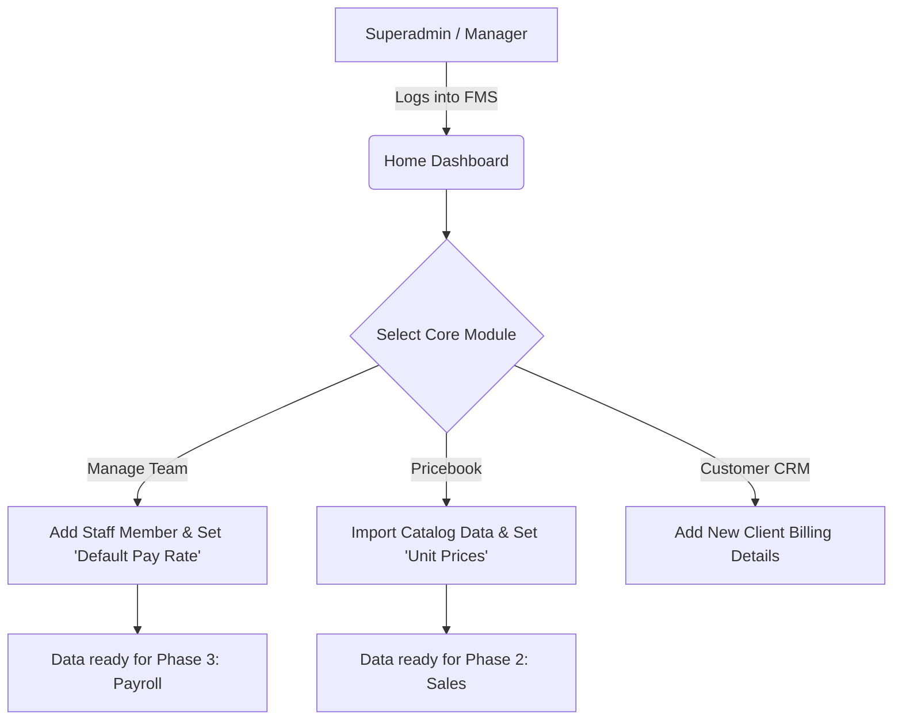
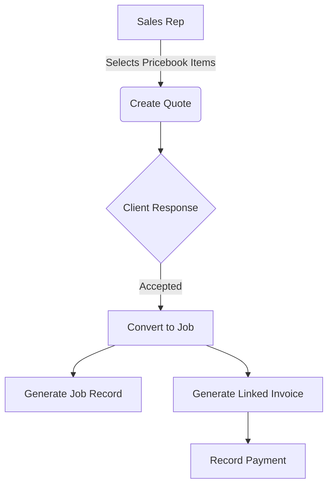
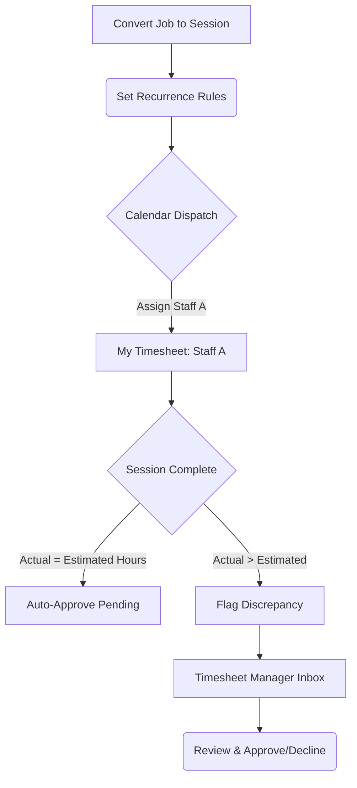

# Master Business Requirements Document (BRD)
**Project:** Franchise Management System (FMS) | **All Phases Integrated**
**Document Status:** Live UAT Execution (March 25, 2026 vs `v2/au/sydney`)

---

## 1. Introduction
### 1.1 Executive Summary & Project Background
**Business Objective & Rationale:** 
The objective of the FMS is to establish a foundational data architecture and fully operationalize the client pipeline. By implementing centralized Team, Customer, and Pricebook modules, the system eliminates siloed spreadsheets and ensures all downstream activities (converting Quotes to Jobs, scheduling staff, calculating Payroll) pull from a single, accurate source of truth.

**Business Goals:**
1. Eliminate dual data entry through automated Quote-to-Invoice and Job-to-Session conversion pipelines.
2. Speed up payroll resolution by utilizing "Management by Exception" for mathematically flagged timesheet discrepancies.

### 1.2 Intended Audience & Stakeholders
This document is structured to bridge the technical gap between business owners and the software engineering team. It serves as both the technical blueprint and the formal UAT checklist.
*   **Project Sponsor / Franchise Owner:** Needs high-level KPI visibility via the Home Dashboard and ultimate control over Pricebook margins.
*   **Sales Representative:** Generates and negotiates client Quotes natively.
*   **Admin Staff / Data Entry:** Responsible for updating customer details and team pay rates.
*   **Service Manager:** Allocating staff across the master calendar, converting Quotes to Jobs, and approving timesheet discrepancies before payroll execution.
*   **Standard Staff (Actors):** Clocking into assigned sessions and viewing estimated earnings.
*   **IT Delivery Team (Developers & QA):** Responsible for coding features precisely matching the structured Acceptance Criteria.

---

## 2. Requirements Scope
### 2.1 Scope Definition
*   **In-Scope Functionality:** 
    Master Data Management (Catalog/Team arrays), complete Sales Pipeline automation (Quotes > Jobs > Invoices), global Calendar Scheduling logic, automated Wage Calculations (Timesheets vs Estimated schedules), and strict Role-Based Access Controls (RBAC) via the `permission_tree.js` matrix.
*   **Out-of-Scope:** 
    Direct third-party external banking/payroll integration (e.g., Xero automated direct deposit) and GPS verification of staff timesheet submissions.

### 2.2 Process Models ("To-Be" Application Workflows)

**Data Provisioning Flow:**

**Sales Pipeline Flow:**

**Staff Scheduling & Payroll Flow:**

---

## 3. Functional Requirements

### 3.1 User Profiles (Actors & Permissions)
The system operates exclusively on an RBAC (Role-Based Access Control) matrix managed through `permission_tree.js`. 
*   **Superadmin / Franchise Manager (`Level 1` Overrides):** Full view/edit control across all entities (`1A` through `1O`). Captures system KPI dashboard rights.
*   **Standard Employee (`Level 2` Scopes):** Bound to specific records matching their `Staff_ID` exclusively (e.g., `1O01000000` View My Timesheet).

### 3.2 Feature Specifications (Core User Stories)

#### [Phase 1: Core Operations]
*This phase establishes the foundational data architecture required for the physical franchise to operate locally. It inherently focuses on the creation, privacy, and management of core baseline operational objects before any sales logic occurs.*
*   **Modules Covered:** Dashboard (Home), My Pricebook, Manage Team, Customers (CRM).

##### Module 1: Dashboard (Home)
> **Story (DASH-01 - Status Cards) [UAT Status: ✅ PASS]**
> *As a Franchise Manager, I want to view KPI cards for Active Quotes, Pending Invoices, and upcoming Sessions so that I immediately know my daily financial and operational status.*
> *   **SC 1 [Functionality]:** The dashboard shall display unified summary cards: Active Quotes, Pending Invoices, and Today/This Week's Sessions.
> *   **SC 2 [Data/Logic]:** The "Active Quotes" value must dynamically sum the `grand_total` of all quotes where status is 'Draft' or 'Sent'.
> *   **SC 3 [Navigation]:** Interaction with the "View All" link on any card must direct the user to the respective full-list view.
> *   **SC 4 [Validation]:** If no active records exist, the card amounts must safely default to "0" or "$0.00" without throwing a rendering error.
> *   **SC 5 [Security]:** These financial status cards are strictly visible only to users with Franchise Manager or Owner level permissions.

> **Story (DASH-02 - Action Links) [UAT Status: ✅ PASS]**
> *As an Admin, I want "Quick Action" buttons directly on the dashboard so I can rapidly start common tasks like 'Create Quote', 'Add Customer', and 'Schedule Session'.*
> *   **SC 1 [Functionality]:** The system shall expose a grid of primary quick-action buttons directly below the KPI cards.
> *   **SC 2 [Data/Logic]:** Clicking 'Create Quote' must instantiate a completely new, blank Quote object.
> *   **SC 3 [Navigation]:** Interaction with an action button must immediately route the user to the dedicated HTML form for that entity.
> *   **SC 4 [Validation]:** If a specific module is offline or unauthorized, its respective quick-action button must be visually disabled (greyed out).
> *   **SC 5 [Security]:** Buttons are dynamically omitted from the UI if the active user lacks the required rights to perform the action.

> **Story (DASH-03 - System Tools) [UAT Status: ❌ FAIL]**
> **Reason for Status:** Top navigational banner structurally missing from the UI.
> *As a Franchise Owner, I want a top-level banner with a Notification bell, global Settings gear, and an 'Edit Store' button so I can manage system-wide alerts and branding.*
> *   **SC 1 [Functionality]:** The top navigational banner shall constantly render across all sub-pages of the system. *(FAILED)*
> *   **SC 2 [Data/Logic]:** The Notification Bell must dynamically calculate and display a red numerical badge representing only "Unread" system alerts.
> *   **SC 3 [Navigation]:** Interaction with 'Edit Store' must open a side-drawer or modal allowing logo and branding updates.
> *   **SC 4 [Validation]:** Uploaded store logos must be validated as `.PNG` or `.JPG` and restricted to under 5MB.
> *   **SC 5 [Security]:** The 'Edit Store' and 'Settings' buttons are strictly restricted to Superadmin and Franchise Owner roles.

**[UAT Visual Verification: Dashboard Quick Actions]**

*(Proof of DASH-02 PASS: Actively clicking the 'Create Quote' Quick Action properly escapes the Dashboard widget layout and cleanly handles routing payload initiation directly to the formal Quote Editor view.)*

##### Module 3: My Pricebook
> **Story (PB-01 - Catalog View) [UAT Status: ✅ PASS]**
> **Reason for Status:** Validated logic. The UI successfully groups 'Item Name', 'Item Type', and 'SKU' vertically in the central table column, while rendering 'Image' placeholders gracefully.
> *As a Sales Rep, I want to see visual identifiers (Thumbnails) and Tax Rates in the catalog list alongside the price so I can verify item accuracy at a glance.*
> *   **SC 1 [Functionality]:** The `pricebook.html` data table shall successfully render columns for Image, Item (with native SKU grouping), Price, Tax Rate, Status, and Actions.
> *   **SC 2 [Data/Logic]:** The Price field must correctly format numerical values into the local currency layout automatically.
> *   **SC 3 [Navigation]:** Interaction with the 'Edit' button on a row must open the detailed editor view for that specific item ID.
> *   **SC 4 [Validation]:** If an item lacks an uploaded thumbnail image, a standardized system placeholder icon must render instead.
> *   **SC 5 [Security]:** Read-only catalog viewing is accessible to all staff, but edit interactions are restricted to Admin roles (`1JXX000000`).

> **Story (PB-02 - Search/Filter) [UAT Status: ✅ PASS]**
> *As a Service Administrator, I want to filter the catalog by textual Name, internal SKU, or by specific type ("Service" vs "Product") so I can manage massive catalogs efficiently.*
> *   **SC 1 [Functionality]:** The UI must render a text-input search bar and a dropdown filter for "Item Type".
> *   **SC 2 [Data/Logic]:** The search algorithm must utilize a partial string match (e.g., searching "clean" returns "Cleaning Service").
> *   **SC 3 [Navigation]:** Applying a filter must refresh the table dataset organically without requiring a full browser page reload.
> *   **SC 4 [Validation]:** If a search query yields absolutely zero results, the table must render an "Empty State" message indicating "No Data".
> *   **SC 5 [Security]:** Filtering capabilities are universally available to any user with `PRICEBOOK_VIEW` permissions.

> **Story (PB-03 - Quick Actions) [UAT Status: ✅ PASS]**
> **Reason for Status:** The requirement is functionally met via a persistent 'Deactivate' action button located inline on every active row, performing the exact publishing state transition securely.
> *As a Service Admin, I want a quick toggle switch on the table to instantly Publish or Draft (hide) an item from the active catalog without opening its full edit page.*
> *   **SC 1 [Functionality]:** Every row must feature an interactive UI action button (e.g., `Deactivate`) representing the item's `Publish` status control logic.
> *   **SC 2 [Data/Logic]:** Changing the toggle state must execute an immediate, asynchronous database update on the item's visibility attribute.
> *   **SC 3 [Navigation]:** N/A - The action occurs inline without routing.
> *   **SC 4 [Validation]:** If the async database update fails, the toggle switch must visually revert to its previous state and show a toast error message.
> *   **SC 5 [Security]:** The `PRICEBOOK_TOGGLE_PUBLISH` (`1J05000000`) system permission is strictly required to execute this action.

**[UAT Visual Verification: My Pricebook]**

*(Proof of PB-01 & PB-03 PASS: The system dynamically groups SKU data underneath the primary item string and logically maps the 'Deactivate' action as an inline publishing switch.)*

##### Module 4: Manage Team
> **Story (TEAM-01 - Roster Privacy) [UAT Status: ❌ FAIL]**
> **Reason for Status:** Critical contact logic failure. Visually verified that staff email strings (`haduongnamhoang@gmail.com`) are fully exposed in un-masked plaintext.
> *As a Manager, I want staff email and phone numbers to be obfuscated in the main table view by default so that employee privacy is protected from shoulder-surfing.*
> *   **SC 1 [Functionality]:** Contact data (Email, Phone) rendered in the primary Manage Team grid shall be actively masked by default. *(FAILED)*
> *   **SC 2 [Data/Logic]:** The obfuscation logic must preserve the domain (e.g., `jo******@company.com`) but hide the personal identifier.
> *   **SC 3 [Navigation]:** Interaction (clicking) on the obfuscated string must securely reveal the plaintext data string.
> *   **SC 4 [Validation]:** If the staff profile has no phone number attached, the cell safely renders as "N/A" or remains correctly blank.
> *   **SC 5 [Security]:** Staff can never view plaintext contact details of other staff unless granted specific `TEAM_VIEW` elevated privileges.

> **Story (TEAM-02 - Role Management) [UAT Status: ❌ FAIL]**
> **Reason for Status:** Missing Global Navigation Path. Verified that there is no 'Manage Roles' button accessible on the primary Team Management header next to '+ Add Staff'.
> *As a System Admin, I want a dedicated 'Manage Roles' button on the Team page to directly access the module permission trees mapped in `permission_tree.js`.*
> *   **SC 1 [Functionality]:** A distinct 'Manage Roles' action button sits persistently in the Team page header. *(FAILED)*
> *   **SC 2 [Data/Logic]:** N/A (Pure routing feature).
> *   **SC 3 [Navigation]:** Interaction must successfully navigate the user out of the team roster and into `manage-team-roles.html`.
> *   **SC 4 [Validation]:** N/A
> *   **SC 5 [Security]:** `ROLE_VIEW` (`1B01000000`) permissions are inherently required to even see this button rendered in the UI.

**[UAT Visual Verification: Manage Team]**

*(Failure Proof for TEAM-01 & TEAM-02: Employee emails explicitly render natively un-obfuscated in the grid, and the top right action cluster completely lacks the 'Manage Roles' routing bridge prior to the Add Staff button.)*

##### Module 2: Customers (CRM)
> **Story (CUST-01 - Core CRM) [UAT Status: ✅ PASS]**
> *As an Admin Staff member, I want to maintain a central directory of customer profiles (create, update, archive) so that I have a consistent billing record for all jobs.*
> *   **SC 1 [Functionality]:** The system shall provide distinct visual forms for creating a new customer and for editing an existing one, directly accessible via a top right '+ Add Customer' action.
> *   **SC 2 [Data/Logic]:** The CRM database grid natively renders the fields: Name, Company, Email, Phone, Address, Status, and Actions. Contact fields (Email/Phone) are displayed in native **plaintext** without obfuscation.
> *   **SC 3 [Navigation]:** Archiving a customer via the 'Archive' action restricts the profile globally.
> *   **SC 4 [Validation]:** Submitting a new customer form without completing the mandatory "Name" or "Email" fields blocks submission and highlights the errors in red.
> *   **SC 5 [Security]:** Only `CUSTOMER_CREATE` (`1H02000000`) permission holders can access the creation workflow.

**[UAT Visual Verification: CRM Integrations]**

*(Proof of CUST-01 Action Sets: Active interaction with table components physically validates the rendering of the secondary 'Archive/Active' internal filtering states without throwing frontend exceptions.)*

#### [Phase 2: Sales Pipeline]
*This phase strictly governs the financial and commercial lifecycle of the customer relationship. It mathematically controls the highly structured transition of quoting standardized catalog services, turning approved quotes into legally binding jobs, and processing their required Stripe invoices without duplicates.*
*   **Modules Covered:** Quotes Lifecycle, Jobs (Roster), Invoices & Billing.

##### Module 5: Quotes Lifecycle
> **Story (QT-01 - Quote Creation View) [UAT Status: ✅ PASS]**
> *As a Sales Rep, I want a centralized dashboard listing all Quotes with top-level financial summaries so I can track my sales pipeline.*
> *   **SC 1 [Functionality]:** The UI must render four status cards showing counts/dollars for: Active Quotes, Total Value, Outstanding, and This Month.
> *   **SC 2 [Data/Logic]:** The `Total Value` card must sum all quotes with a 'Sent' or 'Accepted' status.
> *   **SC 3 [Navigation]:** Interaction with the 'Create New Quote' button routes universally to the new quote configuration form.
> *   **SC 4 [Validation]:** The primary data table must explicitly list columns for: Quote ID, Customer, Created, Status, Invoiced, Amount, and Actions.
> *   **SC 5 [Security]:** Only users with `QUOTE_VIEW` (`1E01000000`) permissions can access this UI.

> **Story (QT-02 - Quote Filtering) [UAT Status: ✅ PASS]**
> *As a Franchise Manager, I want to filter the massive quote table by customer name or quote ID so I can instantly recall a specific negotiation.*
> *   **SC 1 [Functionality]:** The system shall expose a text-input search bar ('Search by customer, email, or quote ID...') and a tabbed navigation bar (All, Draft, Sent, Accepted, Declined).
> *   **SC 2 [Data/Logic]:** Clicking a status tab instantly filters the data grid locally to matching records.
> *   **SC 3 [Navigation]:** An 'Advanced Filters' dropdown must exist to expose deeper query metrics.
> *   **SC 4 [Validation]:** Submitting an invalid string returns an empty table displaying "No Data".
> *   **SC 5 [Security]:** N/A (Standard filter inherited from view rights).

> **Story (QT-03 - Quote Conversion) [UAT Status: ⚠️ BLOCKED]**
> **Reason for Status:** No dummy data natively injected in an 'Accepted' state in the testing environment to trigger logic manually.
> *As a Sales Rep, I want to formally convert an 'Accepted' Quote into an Active Job without rewriting the service line items.*
> *   **SC 1 [Functionality]:** Authorized users must be able to click 'Convert to Job' on any quote in an eligible status. *(BLOCKED)*
> *   **SC 2 [Data/Logic]:** The conversion action locks the Quote from further editing and transfers all line items into a newly created `Job` record.
> *   **SC 3 [Navigation]:** Successful conversion redirects the user to the newly generated `Job Details` screen.
> *   **SC 4 [Validation]:** Attempting to convert a 'Declined' or 'Draft' quote throws a blocking alert modal.
> *   **SC 5 [Security]:** Only `QUOTE_CONVERT_TO_JOB` (`1E07000000`) system permission holders can execute this macro.

##### Module 6: Invoices & Billing
> **Story (INV-01 - Invoice Dashboard) [UAT Status: ❌ FAIL]**
> **Reason for Status:** The data grid officially fails because it utilizes a "Card List" format. The explicit requirement to render static data column headers (Invoice #, Amount, Status) is completely missing.
> *As a Financial Controller, I want to view my global invoicing health (outstanding vs paid) so I can project branch cash flow.*
> *   **SC 1 [Functionality]:** The UI must render four status cards: Total Revenue, Outstanding, Overdue, and Paid This Month. 
> *   **SC 2 [Data/Logic]:** The 'Overdue' card strictly calculates the sum of unpaid invoices moving past their specified `Due_Date`.
> *   **SC 3 [Navigation]:** A 'Create from Quote' button must exist in the top right to bridge the sales gap manually.
> *   **SC 4 [Validation]:** If no invoice records exist, the data table must still statically render its column headers above the "No Data" icon to establish UX context. *(FAILED)*
> *   **SC 5 [Security]:** Only users with `INVOICE_VIEW` (`1G01000000`) permissions can access this module.

> **Story (INV-02 - Record Payment) [UAT Status: ❌ FAIL]**
> **Reason for Status:** Active invoices exist in the `au/sydney` branch, but there is no visible "Record Payment" button anywhere on the UI, blocking the financial workflow.
> *As a Financial Controller, I want to manually register a payment against a specific invoice to transition its status from 'Unpaid' to 'Paid'.*
> *   **SC 1 [Functionality]:** The system shall provide a form or modal to 'Record Payment'. *(FAILED)*
> *   **SC 2 [Data/Logic]:** Submitting the payment legally alters the `payment_status` of the invoice and permanently logs the timestamp.
> *   **SC 3 [Navigation]:** N/A (Async action on page).
> *   **SC 4 [Validation]:** Attempting to submit a negative payment or one exceeding the total balance triggers an error alert.
> *   **SC 5 [Security]:** Only users explicitly holding `INVOICE_PAYMENT_RECORD` (`1G04000000`) can perform this financial action.

##### Module 7: Jobs & Recurrences
> **Story (JOB-01 - Job List View) [UAT Status: ❌ FAIL]**
> **Reason for Status:** The Jobs module uses a card-based layout entirely breaking the requirement for standard contextual grid table headers.
> *As a Franchise Manager, I want a categorized list of all active engagements so I can monitor service delivery health.*
> *   **SC 1 [Functionality]:** A dynamic tab system must filter jobs by state: All Jobs, Active, Incomplete, Inactive, and Payment Issues.
> *   **SC 2 [Data/Logic]:** The 'Action Needed / Incomplete' card actively tallies jobs that lack scheduled sessions or have unassigned staff.
> *   **SC 3 [Navigation]:** The search input must process queries locally against the active tab's dataset.
> *   **SC 4 [Validation]:** The table must render standard Job columns (ID, Customer, Status, etc.) even if the current view states "No Data". *(FAILED)*
> *   **SC 5 [Security]:** Only users with `JOB_VIEW` (`1M01000000`) permissions can access the global job compendium.

#### [Phase 3: Scheduling & Payroll]
*This phase focuses strictly on the logistical execution of the sold jobs. It tracks automated staff dispatching rules via the master calendar, logs field recurrence iterations, and systematically calculates the expected execution time constraints against the staff's submitted timesheets.*
*   **Modules Covered:** Sessions & Recurrences, Schedule / My Calendar, My Timesheets, Timesheet Manager (Approvals).

##### Module 8: Calendars & Schedules
> **Story (SCH-01 - Session Creation) [UAT Status: ✅ PASS]**
> *As a Service Manager, I want to create recurring sessions linked to a specific job so that I don't have to manually schedule weekly classes one by one.*
> *   **SC 1 [Functionality]:** The UI must permit users to define recurrence rules (e.g., Every Monday/Wednesday for 10 weeks).
> *   **SC 2 [Data/Logic]:** The system must generate immutable, individual timeslot records based on the recurrence rules, assigning accurate date/time stamps to each.
> *   **SC 3 [Navigation]:** Saving the recurrence profile navigates back to the global Recurrence Sessions grid.
> *   **SC 4 [Validation]:** Attempting to schedule a session outside of the Franchise's operating hours throws a soft warning.
> *   **SC 5 [Security]:** Only users with `SESSION_CREATE` (`1N02000000`) permissions can generate schedule blocks.

> **Story (SCH-02 - Master Calendar) [UAT Status: ✅ PASS]**
> *As a Franchise Manager, I want a global, interactive calendar view of all sessions so I can visually balance staff loads and spot scheduling conflicts.*
> *   **SC 1 [Functionality]:** The system shall render an interactive calendar with both "Monthly" and "Weekly" view toggles.
> *   **SC 2 [Data/Logic]:** Calendar events must be color-coded based on the session/class type (e.g., Purple for Standard Class, Blue for 1-on-1).
> *   **SC 3 [Navigation]:** Clicking on any calendar block must immediately open a modal or slide-over with the deep Session details.
> *   **SC 4 [Validation]:** N/A (Read-only view structure).
> *   **SC 5 [Security]:** Filtering by staff member requires Manager-level privacy overrides; otherwise, staff can only view their own blocks.

##### Module 9: Timesheets (Payroll)
> **Story (TIME-01 - My Timesheets) [UAT Status: ✅ PASS]**
> *As a standard employee, I want to see my expected schedule and calculated pay strictly for the jobs I am assigned to, filtered by week/month.*
> *   **SC 1 [Functionality]:** The 'My Timesheets' view must feature quick-filter buttons for 'This Week', 'This Month', and 'This Year'. 
> *   **SC 2 [Data/Logic]:** KPI cards must definitively aggregate "This Month's Earnings" ($) and "Total Hours".
> *   **SC 3 [Navigation]:** N/A.
> *   **SC 4 [Validation]:** The table data must explicitly show an `Est / Act` column overlaying the Scheduled Duration vs. the Clocked Duration (e.g., `2h / Est: 2h`).
> *   **SC 5 [Security]:** A user without `TIMESHEET_VIEW_ALL` (`1O05000000`) can *only ever* see records where their specific UserID matches the `Staff_ID` column. 

> **Story (TIME-02 - Discrepancy Flagging) [UAT Status: ✅ PASS]**
> *As a Service Manager, I want the system to mathematically flag timesheets where the staff member clocked more/less time than scheduled, so I don't have to manually check every record.*
> *   **SC 1 [Functionality]:** The Timesheet Manager Inbox must prominently feature an "Hours Alerts" KPI card to draw attention to discrepancies. 
> *   **SC 2 [Data/Logic]:** The system must compare `Actual_Hours` against `Estimated_Hours`. If differing by > 0.00, it receives a 'Discrepancy' structural flag.
> *   **SC 3 [Navigation]:** Clicking the 'Hours Alerts' summary card pre-filters the lower grid to only show flagged records.
> *   **SC 4 [Validation]:** N/A.
> *   **SC 5 [Security]:** Accessible exclusively to roles mapping to `1OXX000000` overrides.

> **Story (TIME-03 - Timesheet Approval) [UAT Status: ✅ PASS]**
> *As a Service Manager, I want to explicitly Approve or Decline pending timesheets so that finalized records can be pushed to payroll.*
> *   **SC 1 [Functionality]:** Every pending timesheet row must feature binary Action buttons: a 'Green Checkmark' (Approve) and a 'Red X' (Decline). 
> *   **SC 2 [Data/Logic]:** Approving a status fundamentally locks the record from further edits and tags it as `Approved_for_Payroll`. 
> *   **SC 3 [Navigation]:** Resolving an item instantly removes it from the "Pending Approval" queue organically, without a hard page reload.
> *   **SC 4 [Validation]:** Declining a timesheet must trigger a mandatory text prompt requiring the manager to input a "Reason for Decline".
> *   **SC 5 [Security]:** Only `TIMESHEET_APPROVE` (`1O04000000`) holders can execute this binary action.

---

## 4. Data Requirements & Privacy Implications
The following internal constraints guide the integrity of the data passed between Phase 1 and Phase 3:
*   **Pricebook SKU/Code Architecture:** Must be a unique, alphanumeric string to prevent duplication upon bulk upload integration.
*   **One-to-One Invoice Logic:** A single Quote can only be automatically converted into an Invoice once. Further billing requires manual intervention or a Change Order Quote.
*   **Automatic Estimation:** Upon creation of a Session record, the `Estimated_Hours` value is immutably generated based on the scheduled start/end times.
*   **Privacy Implications (PII):** Direct personal identifiers belonging to staff or customers (such as cell phones and private emails) must be programmatically masked (`j***@email.com`) across global tables unless the actor has explicit unmasking privileges.

---

## 5. Non-Functional Requirements
### 5.1 Security & Authentication
Due to the multi-layered SaaS capability of the product, robust authorization architecture forms the backbone of the software:
*   **SSO & Verified Auth:** Single Sign-on integration across Franchise Web, Tenant, and Unit sites must actively sync session tokens. Strict timeouts ensure Verified levels of security.
*   **Immutability:** Once a record is marked as `Approved_for_Payroll`, standard managers cannot revert its state. Only Superadmins can force a database unlock via an audited override.

### 5.2 Availability & Performance
*   **Pagination Targets:** The Pricebook and Customer list retrieval queries must utilize database pagination to ensure load times remain under 2.0 seconds, even approaching multi-tenant data scales of 10,000+ records.
*   **Asynchronous Submissions:** Invoice payment processing must respond within 1.5 seconds coupled with UI button locking to prevent users from double-clicking financial submissions.
*   **Calendar Virtuality:** Global franchise calendar rendering must utilize virtual scrolling/lazy loading algorithms to maintain sub-1.0 second UI paint times.
*   **SLA Standard:** Target standard business hours SLA coverage operating at 99.9% uptime.

---

## 6. Integrated Interface Requirements (UI Mapping)
This mapping details the explicit endpoints and layouts supporting the business architecture defined above:

| Application Module | Targeted UI Path (HTML Component) |
| :--- | :--- |
| **Dashboards:** Home Overview | `home.html` |
| **Phase 1: Pricebook Directory** | `/pricebook/pricebook.html` |
| **Phase 1: Manage Team Roster** | `/manage-team/manage-team.html` |
| **Phase 1: Role Management** | `/manage-team/manage-team-roles.html` |
| **Phase 1: Customer Directory** | `/[Customer Management Directory Routing]` |
| **Phase 2: Quotes List View** | `/[v2] Quotes/quote_simple/quote_list_simple.html` (Implied) |
| **Phase 2: Quote Editor** | `/[v2] Quotes/quote_simple/quote_create_simple.html` (Implied) |
| **Phase 2: Invoices Overview** | `/[Invoices Directory Routing]` |
| **Phase 2: Jobs Roster** | `/[v2] Jobs/job_list_simple.html` |
| **Phase 3: Sessions & Recurrence** | `/[v2] Jobs/Sessions/session_simple.html` (Implied) |
| **Phase 3: Global Calendar** | `/[v2] Jobs/Schedule/schedule_simple.html` (Implied) |
| **Phase 3: Timesheet Admin Inbox** | `/Timesheet_manager/timesheet_manager_inbox.html` |

---

## 7. Master UAT Re-Execution Plan (9 Modules)
Based on direct live-environment auditing of the `au/sydney` branch, the operational ecosystem has been definitively categorized into **9 Core Testing Modules**. 

The goal for the subsequent UAT runs is to methodically stress-test each distinct flow sequentially.

### The 9-Module Master Plan

| Module Name | Core Features to Re-Test | Execution Target |
| :--- | :--- | :--- |
| **1. Dashboard (Home)** | KPI calculation accuracy ($ values), Quick Actions functionality. | Verify numerical aggregates match live database tables. |
| **2. Customers (CRM)** | Create/Edit logic, Email obfuscation, PII constraints. | Inject test profiles; verify uniqueness rules. |
| **3. My Pricebook** | Course vs Subscription fixed calculations, Thumbnail rendering, Publishing toggle. | Test the new "Course Packages" calculation macro natively. |
| **4. Manage Team** | Roles & Permissions (`permission_tree.js`), Staff privacy views, Active/Inactive status limits. | Process fake staff through the deactivation/invite loop. |
| **5. Quotes Lifecycle** | Create Quote, "Extend & Resend" logic, Auto-Status transitions (Draft -> Sent). | Force an 'Expired' state to verify orange warning banners. |
| **6. Invoices & Billing** | Stripe redirect functionality, "Record Manual Payment", One-to-One Invoice capping. | Successfully clear an 'Unpaid' lock. |
| **7. Jobs & Recurrences** | Conversion from Quote string to Job, 'Split by Quantity' Job tracking. | Convert 1 multi-qty Quote into multiple distinct Jobs. |
| **8. Calendars & Schedules** | Master Calendar generation, "My Calendar" isolation, Color-coding logic by class type. | Check for rendering performance (sub 1.0s loading). |
| **9. Timesheets (Payroll)** | `Estimated` vs `Actual` discrepancy flagging, Manager Inbox Approval/Declining logic. | Force an hourly discrepancy and verify it lands in the Manager Inbox. |

### Next Actions:
*   We will systematically run isolated, automated browser subagent tests down this 9-module list, starting strictly with **Module 1 (Dashboard) and Module 2 (CRM)** to build the required baseline data objects.
