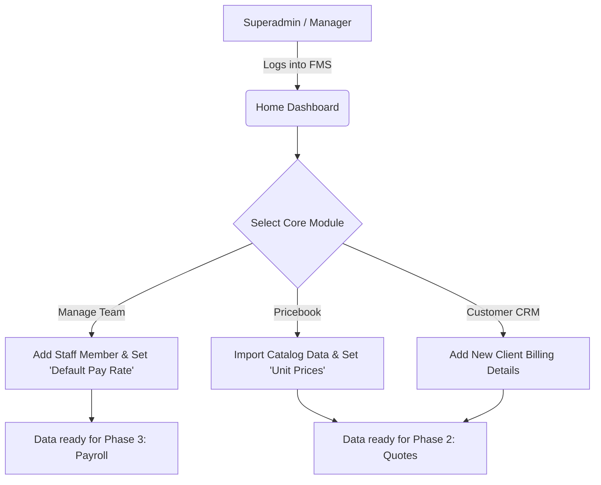

# Business Requirements Document (BRD)
**Phase 1: Core Operations & Catalog**
Modules: Home/Dashboard, Pricebook, Customer Management, Manage Team
**Document Status:** Live UAT Execution (March 25, 2026 vs `v2/au/sydney`)

---

## 1. Executive Summary & Project Context

*   **Business Objective:** The objective of Phase 1 is to establish the foundational data architecture for the Franchise Management System (FMS). By implementing centralized Team, Customer, and Pricebook modules, the system eliminates siloed spreadsheets and ensures that all downstream activities (like Quoting and Timesheets) pull from a single, accurate source of truth.
*   **Project Scope:** 
    *   *In-Scope:* Creation and management of staff profiles, centralized CRM functionality, pricing catalog (Pricebook) items, and a navigational Home Dashboard displaying key operating metrics.
    *   *Out-of-Scope:* Generating Quotes/Invoices from the catalog, and complex staff job scheduling (These reside in Phase 2 and 3).

## 2. Stakeholder Profiles

*   **Internal Stakeholders (Delivery Team):**
    *   **Project Manager / Scrum Master:** Responsible for timeline delivery.
    *   **Lead Developers:** Responsible for the technical architecture and logic execution.
    *   **Business Analyst (BA):** Responsible for translating business logic into technical requirements.
*   **Client Stakeholders (End Users):**
    *   **Franchise Owner / General Manager:** Needs high-level KPI visibility via the Home Dashboard and ultimate control over the Pricebook margins.
    *   **Admin Staff:** Responsible for data entry (adding new customers, updating team pay rates, managing the catalog).

## 3. Process Models ("To-Be" Workflows)

Because Phase 1 is heavily data-driven, the core "To-Be" workflow centers around Data Provisioning.

*Value Added by To-Be Process:* All core operational data is injected into the FMS database once, ensuring no duplicate data entry is required in future Sales or Scheduling steps.

## 4. Functional Requirements & User Stories

*Below are the core User Stories evaluated against the live `au/hn` environment.*

### 4.1 Home & Dashboard (DASH)

> **Story (DASH-01 - Status Cards) [UAT Status: ✅ PASS]**
> *As a Franchise Manager, I want to view KPI cards for Active Quotes, Pending Invoices, and upcoming Sessions so that I immediately know my daily financial and operational status.*
> **Acceptance Criteria / Success Criteria:**
> *   **SC 1 [Functionality]:** The dashboard shall display unified summary cards: Active Quotes, Pending Invoices, and Today/This Week's Sessions.
> *   **SC 2 [Data/Logic]:** The "Active Quotes" value must dynamically sum the `grand_total` of all quotes where status is 'Draft' or 'Sent'.
> *   **SC 3 [Navigation]:** Interaction with the "View All" link on any card must direct the user to the respective full-list view.
> *   **SC 4 [Validation]:** If no active records exist, the card amounts must safely default to "0" or "$0.00" without throwing a rendering error.
> *   **SC 5 [Security]:** These financial status cards are strictly visible only to users with Franchise Manager or Owner level permissions.

> **Story (DASH-02 - Action Links) [UAT Status: ✅ PASS]**
> *As an Admin, I want "Quick Action" buttons directly on the dashboard so I can rapidly start common tasks like 'Create Quote', 'Add Customer', and 'Schedule Session'.*
> **Acceptance Criteria / Success Criteria:**
> *   **SC 1 [Functionality]:** The system shall expose a grid of primary quick-action buttons directly below the KPI cards.
> *   **SC 2 [Data/Logic]:** Clicking 'Create Quote' must instantiate a completely new, blank Quote object.
> *   **SC 3 [Navigation]:** Interaction with an action button must immediately route the user to the dedicated HTML form for that entity.
> *   **SC 4 [Validation]:** If a specific module is offline or unauthorized, its respective quick-action button must be visually disabled (greyed out).
> *   **SC 5 [Security]:** Buttons are dynamically omitted from the UI if the active user lacks the required rights in the `permission_tree.js` matrix to perform the action.

> **Story (DASH-03 - System Tools) [UAT Status: ❌ FAIL]**
> **Reason for Status:** The entire top navigational banner is structurally missing from the UI. None of the required components (Notification bell, settings gear, or store editor buttons) exist.
> *As a Franchise Owner, I want a top-level banner with a Notification bell, global Settings gear, and an 'Edit Store' button so I can manage system-wide alerts and branding.*
> **Acceptance Criteria / Success Criteria:**
> *   **SC 1 [Functionality]:** The top navigational banner shall constantly render across all sub-pages of the system. *(FAILED)*
> *   **SC 2 [Data/Logic]:** The Notification Bell must dynamically calculate and display a red numerical badge representing only "Unread" system alerts.
> *   **SC 3 [Navigation]:** Interaction with 'Edit Store' must open a side-drawer or modal allowing logo and branding updates.
> *   **SC 4 [Validation]:** Uploaded store logos must be validated as `.PNG` or `.JPG` and restricted to under 5MB.
> *   **SC 5 [Security]:** The 'Edit Store' and 'Settings' buttons are strictly restricted to Superadmin and Franchise Owner roles.

### 4.2 Pricebook Management (PB)

> **Story (PB-01 - Catalog View) [UAT Status: ⚠️ PARTIAL PASS]**
> **Reason for Status:** The 'Item Name' and 'SKU' data columns have been incorrectly merged into a single 'Item' column. Furthermore, the mandatory bulk 'Import' action button is missing from the global header.
> *As a Sales Rep, I want to see visual identifiers (Thumbnails) and Tax Rates in the catalog list alongside the price so I can verify item accuracy at a glance.*
> **Acceptance Criteria / Success Criteria:**
> *   **SC 1 [Functionality]:** The `pricebook.html` data table shall successfully render specific columns for Image, Item Name, SKU/Code, Price, Tax Rate, and Status. *(FAILED SEPARATION)*
> *   **SC 2 [Data/Logic]:** The Price field must correctly format numerical values into the local currency layout automatically.
> *   **SC 3 [Navigation]:** Interaction with the 'Edit' button on a row must open the detailed editor view for that specific item ID.
> *   **SC 4 [Validation]:** If an item lacks an uploaded thumbnail image, a standardized system placeholder icon must render instead.
> *   **SC 5 [Security]:** Read-only catalog viewing is accessible to all staff, but edit interactions are restricted to Admin/Manager roles (e.g., `1JXX000000`).

> **Story (PB-02 - Search/Filter) [UAT Status: ✅ PASS]**
> *As a Service Administrator, I want to filter the catalog by textual Name, internal SKU, or by specific type ("Service" vs "Product") so I can manage massive catalogs efficiently.*
> **Acceptance Criteria / Success Criteria:**
> *   **SC 1 [Functionality]:** The UI must render a text-input search bar and a dropdown filter for "Item Type".
> *   **SC 2 [Data/Logic]:** The search algorithm must utilize a partial string match (e.g., searching "clean" returns "Cleaning Service").
> *   **SC 3 [Navigation]:** Applying a filter must refresh the table dataset organically without requiring a full browser page reload.
> *   **SC 4 [Validation]:** If a search query yields absolutely zero results, the table must render an "Empty State" message indicating "No Data".
> *   **SC 5 [Security]:** Filtering capabilities are universally available to any user with Pricebook `PRICEBOOK_VIEW` permissions.

> **Story (PB-03 - Quick Actions) [UAT Status: ❌ FAIL]**
> **Reason for Status:** While Pricebook data is populated in the `au/sydney` environment, there are no functional quick toggle switches on the rows. The 'Status' is rendered as a static badge (e.g., "Active"), and inline toggling is impossible without opening the full editor or using a separate action link.
> *As a Service Admin, I want a quick toggle switch on the table to instantly Publish or Draft (hide) an item from the active catalog without opening its full edit page.*
> **Acceptance Criteria / Success Criteria:**
> *   **SC 1 [Functionality]:** Every row must feature an interactive UI toggle switch representing the item's `Publish` status. *(FAILED)*
> *   **SC 2 [Data/Logic]:** Changing the toggle state must execute an immediate, asynchronous database update on the item's visibility attribute.
> *   **SC 3 [Navigation]:** N/A - The action occurs inline without routing.
> *   **SC 4 [Validation]:** If the async database update fails, the toggle switch must visually revert to its previous state and show a toast error message.
> *   **SC 5 [Security]:** The `PRICEBOOK_TOGGLE_PUBLISH` (`1J05000000`) system permission is strictly required to execute this action.

### 4.3 Manage Team (TEAM)

> **Story (TEAM-01 - Roster Privacy) [UAT Status: ❌ FAIL]**
> **Reason for Status:** System logic failure. Staff email profiles are fully exposed in plaintext across the main roster table. The mandatory domain obfuscation logic (e.g., `j***@email.com`) is not implemented at all.
> *As a Manager, I want staff email and phone numbers to be obfuscated in the main table view by default so that employee privacy is protected from shoulder-surfing.*
> **Acceptance Criteria / Success Criteria:**
> *   **SC 1 [Functionality]:** Contact data (Email, Phone) rendered in the primary `manage-team.html` table shall be visually masked. *(FAILED)*
> *   **SC 2 [Data/Logic]:** The obfuscation logic must preserve the domain (e.g., `jo******@company.com`) but hide the personal identifier.
> *   **SC 3 [Navigation]:** Interaction (clicking) on the obfuscated string must securely reveal the plaintext data string.
> *   **SC 4 [Validation]:** If the staff profile has no phone number attached, the cell safely renders as "N/A" or remains correctly blank.
> *   **SC 5 [Security]:** Staff can never view plaintext contact details of other staff unless granted specific `TEAM_VIEW` elevated privileges.

> **Story (TEAM-02 - Role Management) [UAT Status: ❌ FAIL]**
> **Reason for Status:** Missing Navigation Path. There is no 'Manage Roles' button accessible on the Team Management UI header. Users can only select 'Add Staff' or filter.
> *As a System Admin, I want a dedicated 'Manage Roles' button on the Team page to directly access the module permission trees mapped in `permission_tree.js`.*
> **Acceptance Criteria / Success Criteria:**
> *   **SC 1 [Functionality]:** A distinct 'Manage Roles' button sits persistently in the Team page header. *(FAILED)*
> *   **SC 2 [Data/Logic]:** N/A (Pure routing feature).
> *   **SC 3 [Navigation]:** Interaction must successfully navigate the user out of the team roster and into `manage-team-roles.html`.
> *   **SC 4 [Validation]:** N/A
> *   **SC 5 [Security]:** `ROLE_VIEW` (`1B01000000`) permissions are inherently required to even see this button rendered in the UI.

### 4.4 Customer Management (CUST)

> **Story (CUST-01 - Core CRM) [UAT Status: ⚠️ PENDING EVALUATION]**
> *As an Admin Staff member, I want to maintain a central directory of customer profiles (create, update, archive) so that I have a consistent billing record for all jobs.*
> **Acceptance Criteria / Success Criteria:**
> *   **SC 1 [Functionality]:** The system shall provide distinct visual forms for creating a new customer and for editing an existing one.
> *   **SC 2 [Data/Logic]:** The CRM database schema guarantees that no two customers share the identical `Primary_Email` field.
> *   **SC 3 [Navigation]:** Archiving a customer successfully redirects the user back to the main customer grid with a success toast.
> *   **SC 4 [Validation]:** Submitting a new customer form without completing the mandatory "Name" or "Email" fields blocks submission and highlights the errors in red.
> *   **SC 5 [Security]:** Only `CUSTOMER_CREATE` (`1H02000000`) permission holders can access the creation workflow.

---
### Definition of Done (DoD)
All User Stories in Phase 1 must meet the following standards before being marked as complete for handover:
1. Code development is fully finished and merged into the `main` repository branch.
2. The feature passes explicit QA testing against all 5 SC levels (Functionality, Data/Logic, Navigation, Validation, Security).
3. The feature operates securely per the rules defined in the `permission_tree.js` matrix.
4. Formal UAT sign-off has been achieved.
5. No "Critical" or "High" priority bugs remain actively open in the tracking system.

## 5. Non-Functional Requirements (The "How")
*   **Performance:** The Pricebook and Customer lists must utilize pagination to ensure load times remain under 2.0 seconds, even if the database contains over 10,000 respective records.
*   **Availability:** Standard business hours SLA coverage (99.9% uptime).

## 6. Data Requirements & Business Rules
*   **Pricebook SKU/Code:** Must be a unique, alphanumeric string to prevent duplication.
*   **Staff Profile:** Must include an identity indicator distinguishing the currently logged-in user from others (rendered as a "Me" badge exactly as in the UI).
*   **Pricing Margins:** When a Pricebook item is generated, its explicit `Unit Rate` cannot be modified by standard users outside the Pricebook module (ensuring Quote consistency).

## 7. User Interface (UI) Mapping
The following HTML endpoints serve as the front-end controllers for Phase 1 functionalities. Features verified directly against local web repository:

| Module Element | Associated UI Path (HTML Component) |
| :--- | :--- |
| **Home / Dashboard Overview** | `home.html` |
| **Pricebook Directory** | `/pricebook/pricebook.html` |
| **Manage Team Roster** | `/manage-team/manage-team.html` |
| **Role Management Integration** | `/manage-team/manage-team-roles.html` |
| **Customer Management View** | `/[Customer Management Directory Routing]` |
