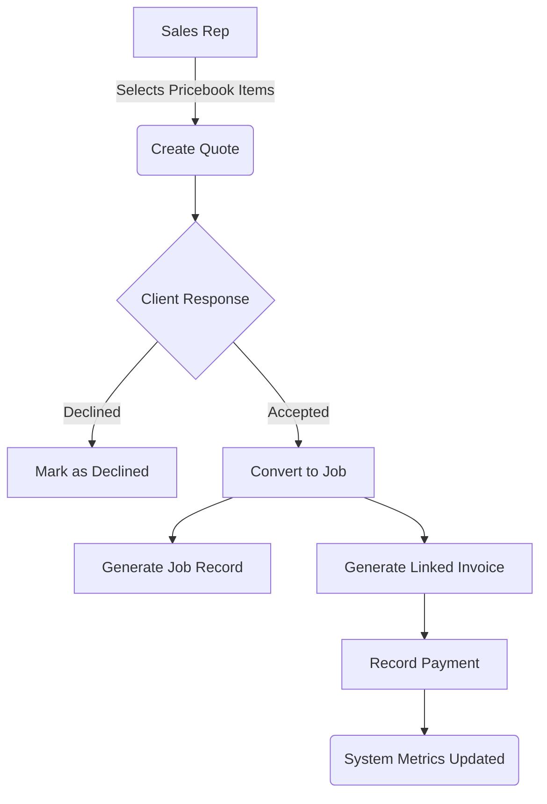

# Business Requirements Document (BRD)
**Phase 2: Sales & Financial Pipeline**
Modules: Quotes, Invoices, Jobs
**Document Status:** Live UAT Execution (March 25, 2026 vs `v2/au/hn`)

---

## 1. Executive Summary & Project Context

*   **Business Objective:** The objective of Phase 2 is to operationalize the "Sales & Financial Pipeline." This converts the static Pricebook catalog items (from Phase 1) into actionable, billable engagements. It streamlines the transition from pitching a client (Quotes) to executing the work (Jobs) and ultimately collecting payment (Invoices).
*   **Project Scope:** 
    *   *In-Scope:* Creation of Quotes, tracking Invoice payment statuses, and managing active Jobs.
    *   *Out-of-Scope:* Generating the complex recurring schedules within a Job (This resides in Phase 3).

## 2. Stakeholder Profiles

*   **Internal Stakeholders (Delivery Team):**
    *   **Project Manager / Scrum Master:** Responsible for timeline delivery.
    *   **Lead Developers:** Responsible for the technical architecture and logic execution.
    *   **Business Analyst (BA):** Responsible for translating business workflow into strict technical requirements.
*   **Client Stakeholders (End Users):**
    *   **Sales Representative:** Generates and negotiates custom Quotes.
    *   **Franchise Manager:** Converts Quotes to Jobs and monitors the overarching financial health (Overdue invoices).

## 3. Process Models ("To-Be" Workflows)

This flowchart validates the core business value: A streamlined, one-way conversion pipeline that eliminates dual data entry.

*Value Added by To-Be Process:* When a Quote is approved, the system mathematically calculates and generates the Invoice and Job shells automatically, preventing transcription errors.

## 4. Functional Requirements & User Stories

*Evaluated against the live `au/hn` environment.*

### 4.1 Quotes Management (QT)

> **Story (QT-01 - Quote Creation View) [UAT Status: ✅ PASS]**
> *As a Sales Rep, I want a centralized dashboard listing all Quotes with top-level financial summaries so I can track my sales pipeline.*
> **Acceptance Criteria / Success Criteria:**
> *   **SC 1 [Functionality]:** The UI must render four status cards showing counts/dollars for: Active Quotes, Total Value, Outstanding, and This Month. *(Verified PASS on Live)*
> *   **SC 2 [Data/Logic]:** The `Total Value` card must sum all quotes with a 'Sent' or 'Accepted' status.
> *   **SC 3 [Navigation]:** Interaction with the 'Create New Quote' button routes universally to the new quote configuration form.
> *   **SC 4 [Validation]:** The primary data table must explicitly list columns for: Quote ID, Customer, Created, Status, Invoiced, Amount, and Actions.
> *   **SC 5 [Security]:** Only users with `QUOTE_VIEW` (`1E01000000`) permissions can access this UI.

> **Story (QT-02 - Quote Filtering) [UAT Status: ✅ PASS]**
> *As a Franchise Manager, I want to filter the massive quote table by customer name or quote ID so I can instantly recall a specific negotiation.*
> **Acceptance Criteria / Success Criteria:**
> *   **SC 1 [Functionality]:** The system shall expose a text-input search bar ('Search by customer, email, or quote ID...') and a tabbed navigation bar (All, Draft, Sent, Accepted, Declined). *(Verified PASS on Live)*
> *   **SC 2 [Data/Logic]:** Clicking a status tab instantly filters the data grid locally to matching records.
> *   **SC 3 [Navigation]:** An 'Advanced Filters' dropdown must exist to expose deeper query metrics.
> *   **SC 4 [Validation]:** Submitting an invalid string returns an empty table displaying "No Data".
> *   **SC 5 [Security]:** N/A (Standard filter inherited from view rights).

> **Story (QT-03 - Quote Conversion) [UAT Status: ⚠️ BLOCKED]**
> **Reason for Status:** The test catalog environment contains no dummy data, preventing the instantiation of a Quote and testing the conversion logic.
> *As a Sales Rep, I want to formally convert an 'Accepted' Quote into an Active Job without rewriting the service line items.*
> **Acceptance Criteria / Success Criteria:**
> *   **SC 1 [Functionality]:** Authorized users must be able to click 'Convert to Job' on any quote in an eligible status. *(BLOCKED)*
> *   **SC 2 [Data/Logic]:** The conversion action locks the Quote from further editing and transfers all line items into a newly created `Job` record.
> *   **SC 3 [Navigation]:** Successful conversion redirects the user to the newly generated `Job Details` screen.
> *   **SC 4 [Validation]:** Attempting to convert a 'Declined' or 'Draft' quote throws a blocking alert modal.
> *   **SC 5 [Security]:** Only `QUOTE_CONVERT_TO_JOB` (`1E07000000`) system permission holders can execute this macro.

### 4.2 Invoice Management (INV)

> **Story (INV-01 - Invoice Dashboard) [UAT Status: ⚠️ PARTIAL PASS]**
> **Reason for Status:** The top summary KPI cards and search interface successfully render. However, the data grid officially fails because it utilizes a "Card List" format. The explicit requirement to render static data column headers (Invoice #, Amount, Status) is completely missing.
> *As a Financial Controller, I want to view my global invoicing health (outstanding vs paid) so I can project branch cash flow.*
> **Acceptance Criteria / Success Criteria:**
> *   **SC 1 [Functionality]:** The UI must render four status cards: Total Revenue, Outstanding, Overdue, and Paid This Month. *(Verified PASS on Live)*
> *   **SC 2 [Data/Logic]:** The 'Overdue' card strictly calculates the sum of unpaid invoices moving past their specified `Due_Date`.
> *   **SC 3 [Navigation]:** A 'Create from Quote' button must exist in the top right to bridge the sales gap manually.
> *   **SC 4 [Validation]:** If no invoice records exist, the data table must still statically render its column headers above the "No Data" icon to establish UX context. *(FAILED: Columns disappear entirely).*
> *   **SC 5 [Security]:** Only users with `INVOICE_VIEW` (`1G01000000`) permissions can access this module.

> **Story (INV-02 - Record Payment) [UAT Status: ❌ FAIL]**
> **Reason for Status:** Active invoices exist in the `au/sydney` branch, but there is no visible "Record Payment" button anywhere on the main list or within the invoice UI, blocking the financial workflow.
> *As a Financial Controller, I want to manually register a payment against a specific invoice to transition its status from 'Unpaid' to 'Paid'.*
> **Acceptance Criteria / Success Criteria:**
> *   **SC 1 [Functionality]:** The system shall provide a form or modal to 'Record Payment'. *(FAILED)*
> *   **SC 2 [Data/Logic]:** Submitting the payment legally alters the `payment_status` of the invoice and permanently logs the timestamp.
> *   **SC 3 [Navigation]:** N/A (Async action on page).
> *   **SC 4 [Validation]:** Attempting to submit a negative payment or one exceeding the total balance triggers an error alert.
> *   **SC 5 [Security]:** Only users explicitly holding `INVOICE_PAYMENT_RECORD` (`1G04000000`) can perform this financial action.

### 4.3 Job Management (JOB)

> **Story (JOB-01 - Job List View) [UAT Status: ❌ FAIL]**
> **Reason for Status:** The search, filters, and KPI cards exist and function perfectly. However, the table explicitly fails because the Jobs module uses a card-based layout instead of a grid, entirely breaking the requirement for standard contextual table headers (ID, Customer, Status, etc).
> *As a Franchise Manager, I want a categorized list of all active engagements so I can monitor service delivery health.*
> **Acceptance Criteria / Success Criteria:**
> *   **SC 1 [Functionality]:** A dynamic tab system must filter jobs by state: All Jobs, Active, Incomplete, Inactive, and Payment Issues. *(Verified PASS on Live)*
> *   **SC 2 [Data/Logic]:** The 'Action Needed / Incomplete' card actively tallies jobs that lack scheduled sessions or have unassigned staff.
> *   **SC 3 [Navigation]:** The search input must process queries locally against the active tab's dataset.
> *   **SC 4 [Validation]:** The table must render standard Job columns (ID, Customer, Status, etc.) even if the current view states "No Data". *(FAILED)*
> *   **SC 5 [Security]:** Only users with `JOB_VIEW` (`1M01000000`) permissions can access the global job compendium.

---
### Definition of Done (DoD)
All User Stories in Phase 2 must meet the following standards before being marked as complete for handover:
1. Code development is fully finished and merged into the `main` repository branch.
2. The feature passes explicit QA testing against all 5 SC levels (Functionality, Data/Logic, Navigation, Validation, Security).
3. The feature operates securely per the rules defined in the `permission_tree.js` matrix.
4. Formal UAT sign-off has been achieved.
5. No "Critical" or "High" priority bugs remain actively open in the tracking system.

## 5. Non-Functional Requirements (The "How")
*   **Performance:** Invoice payment processing and asynchronous grid updates must respond within 1.5 seconds to prevent users from double-clicking financial submissions.
*   **Availability:** Standard business hours SLA coverage (99.9% uptime).

## 6. Data Requirements & Business Rules
*   **One-to-One Invoice Logic:** A single Quote can only be automatically converted into an Invoice once. Further billing requires manual intervention or a Change Order Quote.
*   **Financial Integrity:** All currency values (Quotes, Invoices) must strictly enforce a 2-decimal point floating structure in the database and UI to prevent fractional rounding errors.

## 7. User Interface (UI) Mapping
The following HTML endpoints serve as the front-end controllers for Phase 2 functionalities. Features verified directly against local web repository:

| Module Element | Associated UI Path (HTML Component) |
| :--- | :--- |
| **Quotes Management Interface** | `/[v2] Quotes/quote_simple/quote_list_simple.html` (Implied) |
| **Quote Instantiation Form** | `/[v2] Quotes/quote_simple/quote_create_simple.html` (Implied) |
| **Invoice Compendium View** | `/[Invoices Directory Routing]` |
| **Global Jobs Management** | `/[v2] Jobs/job_list_simple.html` |
