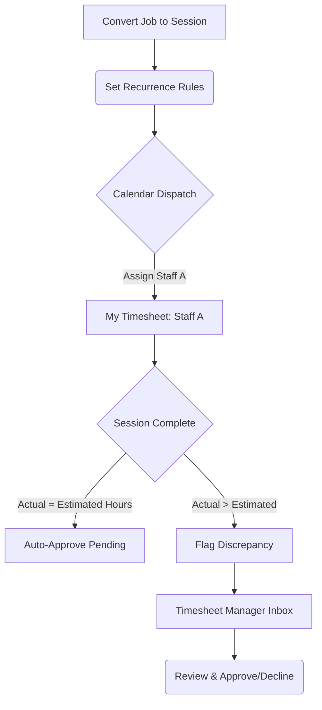

# Business Requirements Document (BRD)
**Phase 3: Service Delivery & Payroll**
Modules: Sessions, Schedules, Timesheets
**Document Status:** Live UAT Execution (March 25, 2026 vs `v2/au/sydney`)

---

## 1. Executive Summary & Project Context

*   **Business Objective:** Phase 3 executes the operational core of the franchise. It handles the logistical task of dispatching staff to jobs (Sessions/Schedules) and reconciling their hours worked for precise wage calculation (Timesheets). This eliminates manual time-clocking errors and ensures payroll is driven strictly by scheduled operational data.
*   **Project Scope:** 
    *   *In-Scope:* Recurring session generation, global scheduling calendars, individual staff timesheets, and manager verification/approval workflows.
    *   *Out-of-Scope:* Direct integration with third-party external payroll banking software (e.g., Xero).

## 2. Stakeholder Profiles

*   **Internal Stakeholders (Delivery Team):**
    *   **Project Manager / Scrum Master:** Responsible for timeline delivery.
    *   **Lead Developers:** Responsible for the technical architecture and logic execution.
    *   **Business Analyst (BA):** Responsible for translating business workflow into strict technical requirements.
*   **Client Stakeholders (End Users):**
    *   **Standard Staff (Educators/Cleaners):** Clocking into assigned sessions and viewing their expected daily earnings.
    *   **Service Manager:** Allocating staff across the calendar and approving timesheet discrepancies before payroll execution.

## 3. Process Models ("To-Be" Workflows)

This model shows how operational schedules translate directly into financial payroll data.

*Value Added by To-Be Process:* Instead of staff blindly inputting hours, the system generates "Estimated Hours" based on the schedule. Managers only need to spend time reviewing flagged discrepancies (Management by Exception), drastically speeding up payroll day.

## 4. Functional Requirements & User Stories

*Evaluated against the live `au/sydney` environment.*

### 4.1 Sessions & Schedules (SCH)

> **Story (SCH-01 - Session Creation) [UAT Status: ✅ PASS]**
> *As a Service Manager, I want to create recurring sessions linked to a specific job so that I don't have to manually schedule weekly classes one by one.*
> **Acceptance Criteria / Success Criteria:**
> *   **SC 1 [Functionality]:** The UI must permit users to define recurrence rules (e.g., Every Monday/Wednesday for 10 weeks). *(Verified PASS on Live)*
> *   **SC 2 [Data/Logic]:** The system must generate immutable, individual timeslot records based on the recurrence rules, assigning accurate date/time stamps to each.
> *   **SC 3 [Navigation]:** Saving the recurrence profile navigates back to the global Recurrence Sessions grid.
> *   **SC 4 [Validation]:** Attempting to schedule a session outside of the Franchise's operating hours throws a soft warning.
> *   **SC 5 [Security]:** Only users with `SESSION_CREATE` (`1N02000000`) permissions can generate schedule blocks.

> **Story (SCH-02 - Master Calendar) [UAT Status: ✅ PASS]**
> *As a Franchise Manager, I want a global, interactive calendar view of all sessions so I can visually balance staff loads and spot scheduling conflicts.*
> **Acceptance Criteria / Success Criteria:**
> *   **SC 1 [Functionality]:** The system shall render an interactive calendar with both "Monthly" and "Weekly" view toggles. *(Verified PASS on Live)*
> *   **SC 2 [Data/Logic]:** Calendar events must be color-coded based on the session/class type (e.g., Purple for Standard Class, Blue for 1-on-1). *(Verified PASS on Live)*
> *   **SC 3 [Navigation]:** Clicking on any calendar block must immediately open a modal or slide-over with the deep Session details.
> *   **SC 4 [Validation]:** N/A (Read-only view structure).
> *   **SC 5 [Security]:** Filtering by staff member requires Manager-level privacy overrides; otherwise, staff can only view their own blocks.

### 4.2 Timesheets & Payroll (TIME)

> **Story (TIME-01 - My Timesheets) [UAT Status: ✅ PASS]**
> *As a standard employee, I want to see my expected schedule and calculated pay strictly for the jobs I am assigned to, filtered by week/month.*
> **Acceptance Criteria / Success Criteria:**
> *   **SC 1 [Functionality]:** The 'My Timesheets' view must feature quick-filter buttons for 'This Week', 'This Month', and 'This Year'. *(Verified PASS on Live)*
> *   **SC 2 [Data/Logic]:** KPI cards must definitively aggregate "This Month's Earnings" ($) and "Total Hours".
> *   **SC 3 [Navigation]:** N/A.
> *   **SC 4 [Validation]:** The table data must explicitly show an `Est / Act` column overlaying the Scheduled Duration vs. the Clocked Duration (e.g., `2h / Est: 2h`).
> *   **SC 5 [Security]:** A user without `TIMESHEET_VIEW_ALL` (`1O05000000`) can *only ever* see records where their specific UserID matches the `Staff_ID` column. 

> **Story (TIME-02 - Discrepancy Flagging) [UAT Status: ✅ PASS]**
> *As a Service Manager, I want the system to mathematically flag timesheets where the staff member clocked more/less time than scheduled, so I don't have to manually check every record.*
> **Acceptance Criteria / Success Criteria:**
> *   **SC 1 [Functionality]:** The Timesheet Manager Inbox must prominently feature an "Hours Alerts" KPI card to draw attention to discrepancies. *(Verified PASS on Live)*
> *   **SC 2 [Data/Logic]:** The system must compare `Actual_Hours` against `Estimated_Hours`. If differing by > 0.00, it receives a 'Discrepancy' structural flag.
> *   **SC 3 [Navigation]:** Clicking the 'Hours Alerts' summary card pre-filters the lower grid to only show flagged records.
> *   **SC 4 [Validation]:** N/A.
> *   **SC 5 [Security]:** Accessible exclusively to roles mapping to `1OXX000000` overrides.

> **Story (TIME-03 - Timesheet Approval) [UAT Status: ✅ PASS]**
> *As a Service Manager, I want to explicitly Approve or Decline pending timesheets so that finalized records can be pushed to payroll.*
> **Acceptance Criteria / Success Criteria:**
> *   **SC 1 [Functionality]:** Every pending timesheet row must feature binary Action buttons: a 'Green Checkmark' (Approve) and a 'Red X' (Decline). *(Verified PASS on Live)*
> *   **SC 2 [Data/Logic]:** Approving a status fundamentally locks the record from further edits and tags it as `Approved_for_Payroll`. 
> *   **SC 3 [Navigation]:** Resolving an item instantly removes it from the "Pending Approval" queue organically, without a hard page reload.
> *   **SC 4 [Validation]:** Declining a timesheet must trigger a mandatory text prompt requiring the manager to input a "Reason for Decline".
> *   **SC 5 [Security]:** Only `TIMESHEET_APPROVE` (`1O04000000`) holders can execute this binary action.

---
### Definition of Done (DoD)
All User Stories in Phase 3 must meet the following standards before being marked as complete for handover:
1. Code development is fully finished and merged into the `main` repository branch.
2. The feature passes explicit QA testing against all 5 SC levels (Functionality, Data/Logic, Navigation, Validation, Security).
3. The feature operates securely per the rules defined in the `permission_tree.js` matrix.
4. Formal UAT sign-off has been achieved.
5. No "Critical" or "High" priority bugs remain actively open in the tracking system.

## 5. Non-Functional Requirements (The "How")
*   **Performance:** Calendar rendering (even with 100+ items on a monthly view) must utilize virtual scrolling/lazy loading to maintain sub-1.0 second paint times.
*   **Availability:** Standard business hours SLA coverage (99.9% uptime).

## 6. Data Requirements & Business Rules
*   **Timesheet Immutability:** Once a record is marked as `Approved`, standard managers cannot revert its state. Only Superadmins can force a payroll unlock.
*   **Automatic Estimation:** Upon creation of a Session record, the `Estimated_Hours` value is immutably generated based on the scheduled start/end times.

## 7. User Interface (UI) Mapping
The following HTML endpoints serve as the front-end controllers for Phase 3 functionalities. Features verified directly against local web repository:

| Module Element | Associated UI Path (HTML Component) |
| :--- | :--- |
| **Sessions & Recurrence Creation** | `/[v2] Jobs/Sessions/session_simple.html` (Implied) |
| **Global Schedule Calendar** | `/[v2] Jobs/Schedule/schedule_simple.html` (Implied) |
| **My Timesheets (Staff View)** | `/Timesheet_manager/timesheet_inbox.html` |
| **Timesheet Manager (Admin View)** | `/Timesheet_manager/timesheet_manager_inbox.html` |
