# FMS Master Flowcharts Library

This document centrally aggregates all active `mermaid` flowcharts and architectural diagrams defining the Franchise Management System (FMS). Historical (Archived) diagrams have been intentionally excluded to serve as the single source of truth for current operations.

---

## 1. Core Platform Architecture (Master BRD)

### Data Provisioning Flow
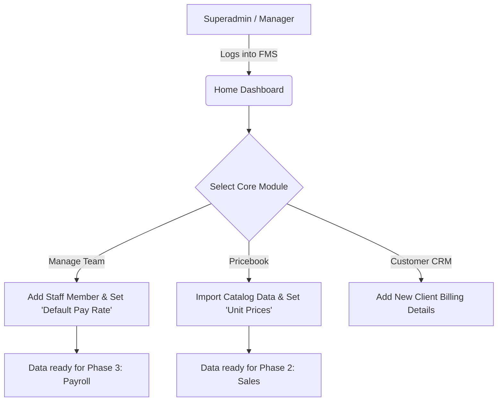

### Sales Pipeline Flow
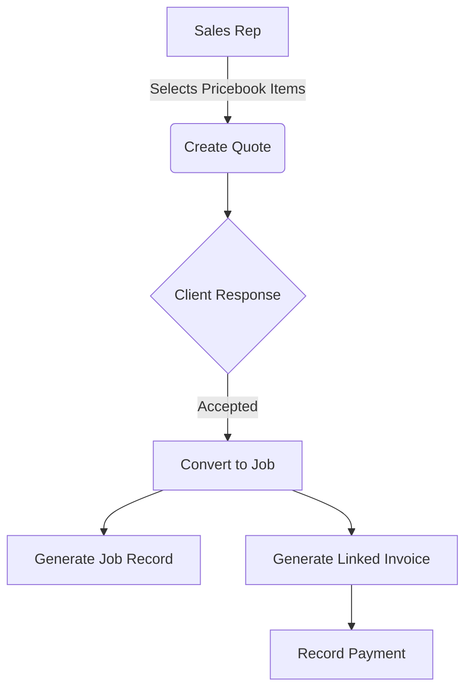

### Staff Scheduling & Payroll Flow
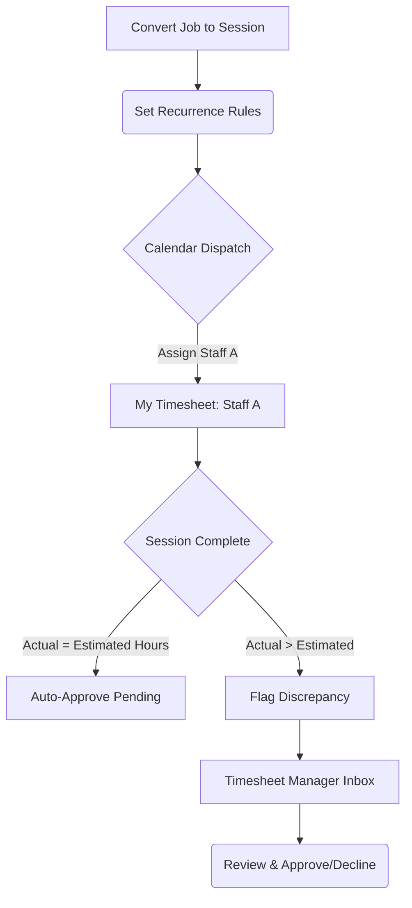

---

## 2. Pricebook & Course Configuration

### Course Logic Configuration Flow
```mermaid
graph TD
    A[Start: Create Item] --> B{Package Type?}
    
    B -->|Subscription| C[Frequency: Weekly/Monthly]
    
    B -->|Course| D[Period Configuration]
    D --> D1[Select Period: Week/Month]
    D --> D2[Enter Days per Period (e.g., 4)]
    D --> D3[Enter Duration (e.g., 3 Weeks)]
    
    D3 --> E[Calculate Total Sessions]
    E -->|4 * 3 = 12| F[Total Sessions: 12]
    
    F --> G[Pricing]
    G --> G1[Input: Price per Session ($50)]
    G1 --> G2[Calculate Total Price: 12 * 50 = $600]
```

---

## 3. Team Management

### User Journey
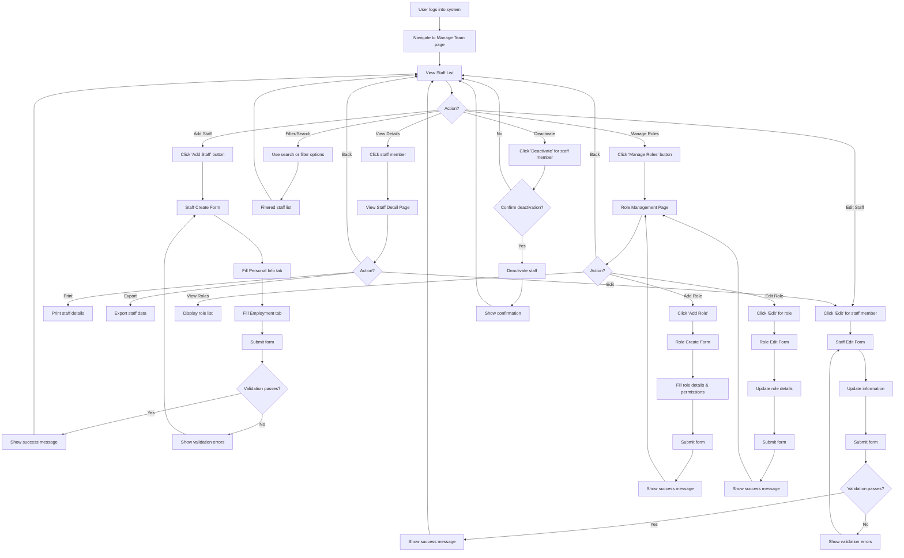

### Staff Management Operations (Sequence)
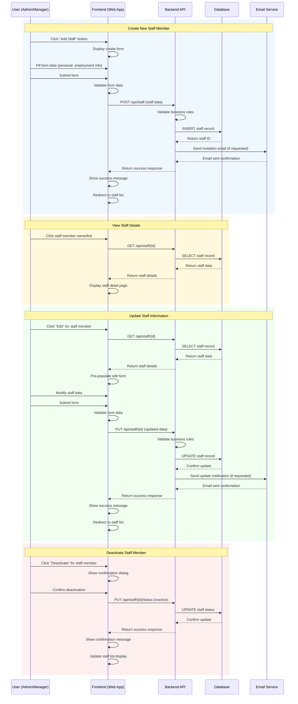

---

## 4. Quotes & Sales Lifecycle

### To-Be Quote-to-Cash + Field Service
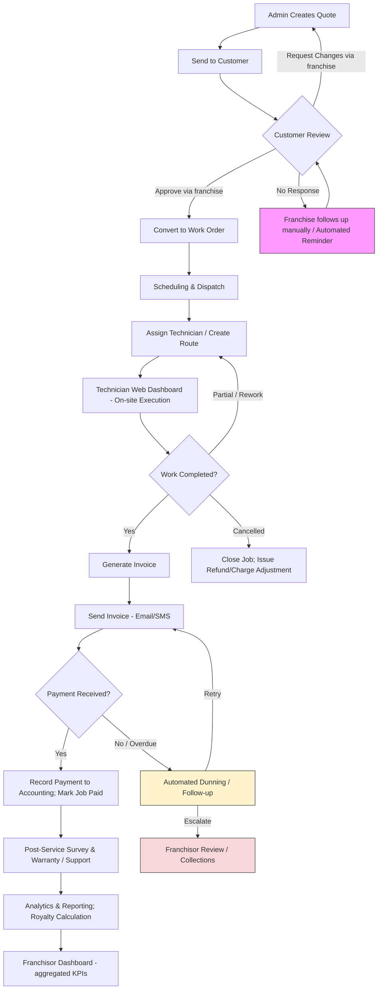

### Quote Status Lifecycle
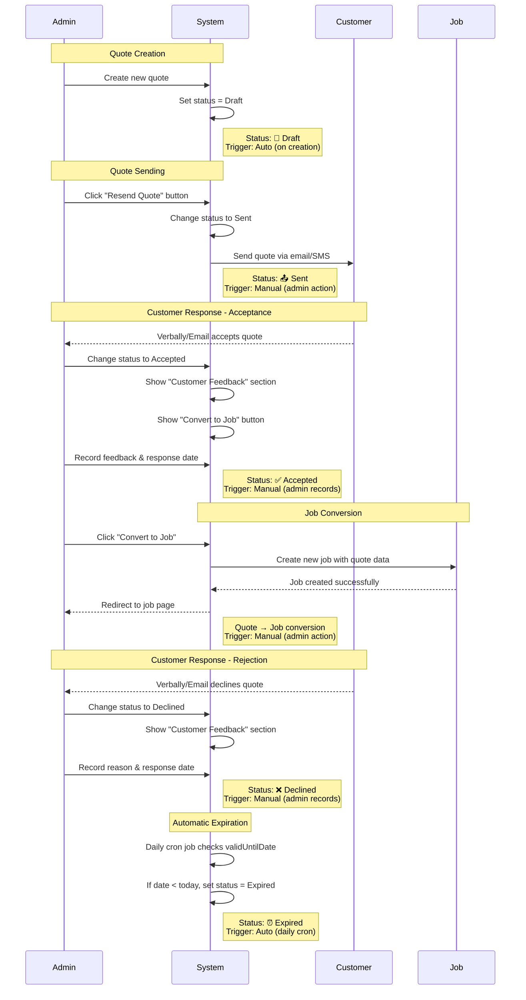

### Extend & Resend Workflow
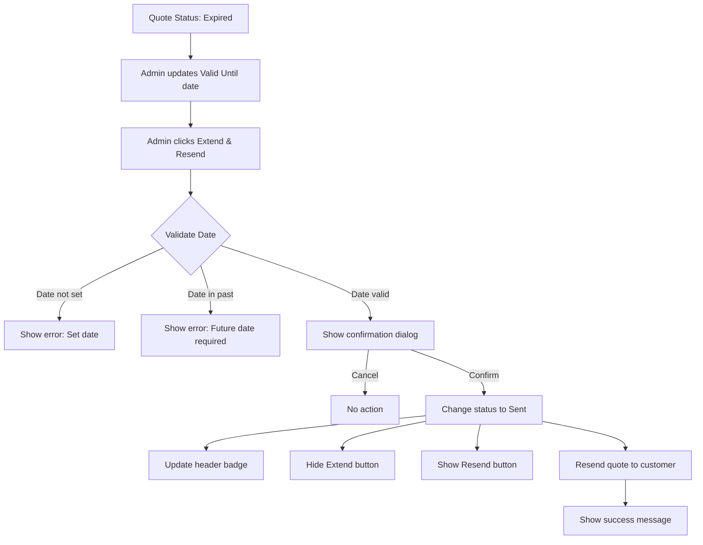

---

## 5. Simplified Financial & Operational Models

### End-to-End Financial Flow (One-Time vs Subscription)
```mermaid
graph TD
    subgraph Legend["Legend"]
        direction LR
        L2[System Process]
        L3((Start / End))
        L4[Auto System]
        L5[/User Action/]
        L6[Status]
    end
    
    style L2 fill:#ECECFF,stroke:#9370DB
    style L3 fill:#f9f,stroke:#333,stroke-width:2px
    style L4 fill:#FFD700,stroke:#B8860B
    style L5 fill:#DAE8FC,stroke:#6C8EBF
    style L6 fill:#D5E8D4,stroke:#82B366
    
    subgraph Flow["Simplified Financial Flow"]
        Start((Start Financial Event)) --> Trigger{Service Type?}
        
        Trigger -->|1. One-Time Service| CreateInv[/User Clicks Create Invoice/]
        CreateInv --> InvA[System Creates Invoice<br/>for FULL QUOTE AMOUNT<br/>Status: UNPAID]
        InvA --> GenLink[System Creates Payment Link]
        GenLink --> SendLink[/User Manually Sends Link<br/>Email/SMS/WhatsApp/]
        SendLink --> Pay1[Customer Pays FULL AMOUNT via Link]
        Pay1 --> S_Paid[Invoice Status: PAID<br/>Quote Status: PAID]
        S_Paid --> End1((Quote Complete))
        
        Trigger -->|2. Subscription Service| Scheduler[System Scheduler Triggers<br/>e.g., 1st day of month]
        Scheduler --> CardOnFile{Customer has saved<br/>Credit Card/Account?}
        
        CardOnFile -->|Yes 99% Case| AutoCharge[System AUTO-CHARGES<br/>FULL AMOUNT<br/>Stripe/PayPal Auto-Charge]
        AutoCharge --> ChargeOK{Charge Successful?}
        ChargeOK -->|Yes| AutoInvPaid[System Creates Invoice Status: PAID<br/>and Sends Receipt]
        AutoInvPaid --> Loop2((Wait for next cycle))
        Loop2 --> Scheduler
        
        ChargeOK -->|No Card Error| Dunning[Start Dunning Process<br/>Send emails, retry...]
        Dunning --> EndFail((Pause Subscription))
        
        CardOnFile -->|No Rare Case| AutoInvUnpaid[System Auto-Creates<br/>Invoice Status: UNPAID<br/>FULL AMOUNT]
        AutoInvUnpaid --> GenLink2[System Creates Payment Link]
        GenLink2 --> SendLink2[System Auto-Sends Link<br/>e.g., Email invoice]
        SendLink2 --> Pay1
    end
    
    style CreateInv fill:#DAE8FC,stroke:#6C8EBF
    style SendLink fill:#DAE8FC,stroke:#6C8EBF
    
    style InvA fill:#ECECFF,stroke:#9370DB
    style GenLink fill:#ECECFF,stroke:#9370DB
    style Pay1 fill:#ECECFF,stroke:#9370DB
    style GenLink2 fill:#ECECFF,stroke:#9370DB
    
    style Scheduler fill:#FFD700,stroke:#B8860B
    style AutoCharge fill:#FFD700,stroke:#B8860B
    style AutoInvPaid fill:#FFD700,stroke:#B8860B
    style Dunning fill:#FFD700,stroke:#B8860B
    style AutoInvUnpaid fill:#FFD700,stroke:#B8860B
    style SendLink2 fill:#FFD700,stroke:#B8860B
    
    style S_Paid fill:#D5E8D4,stroke:#82B366
```

### Simplified Job Status Lifecycle
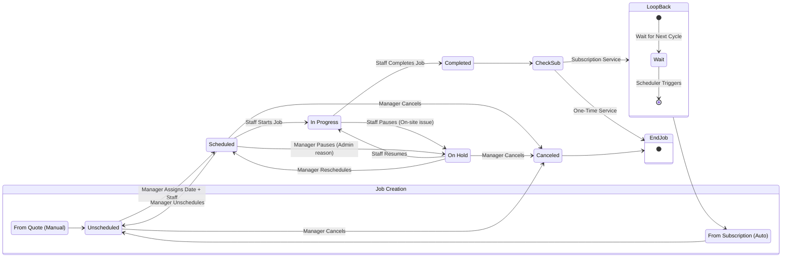

---

## 6. Multi-Quantity Session Enrollment
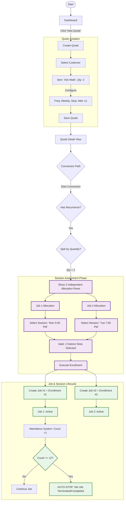
