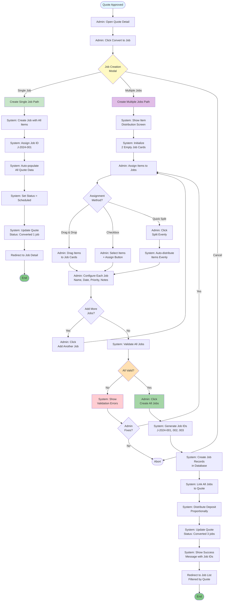
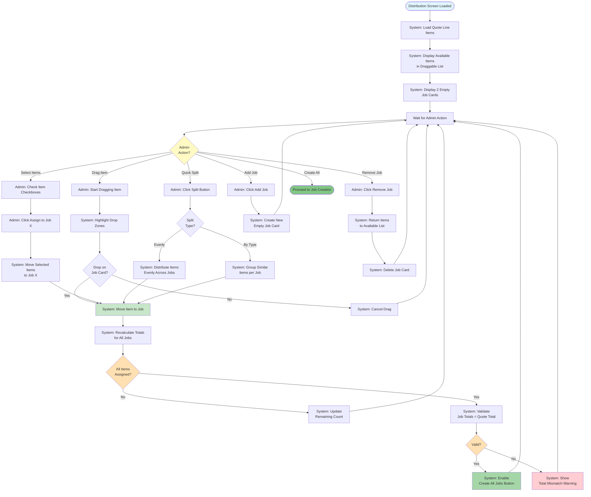
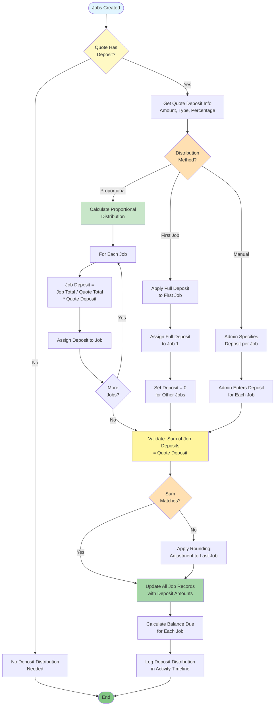
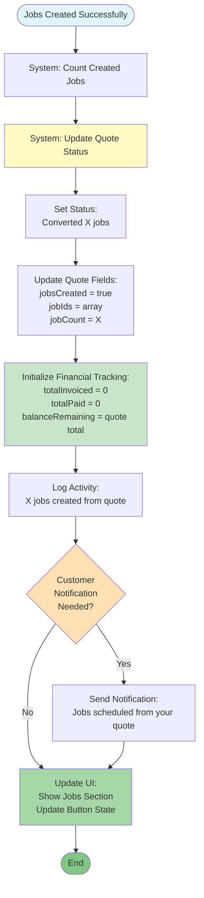
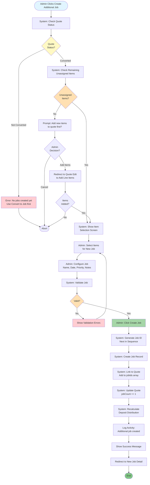

# Job Creation Flow Diagrams - Multiple Jobs Per Quote

## 1. Complete Job Creation Flow

---

## 2. Item Distribution Interface Flow

---

## 3. Validation Flow

```mermaid
flowchart TD
    Start([Admin Clicks Create All Jobs]) --> ValidateStart[System: Start Validation]
    
    ValidateStart --> CheckAllAssigned{All Items<br/>Assigned?}
    
    CheckAllAssigned -->|No| ErrorUnassigned[Error: X items not assigned]
    CheckAllAssigned -->|Yes| CheckJobsNotEmpty
    
    ErrorUnassigned --> ShowError1[Show Error Message]
    ShowError1 --> Return1([Return to Distribution])
    
    CheckJobsNotEmpty{All Jobs<br/>Have Items?}
    
    CheckJobsNotEmpty -->|No| ErrorEmpty[Error: Job X has no items]
    CheckJobsNotEmpty -->|Yes| CheckTotals
    
    ErrorEmpty --> ShowError2[Show Error Message]
    ShowError2 --> Return2([Return to Distribution])
    
    CheckTotals{Sum of Job Totals<br/>= Quote Total?}
    
    CheckTotals -->|No| ErrorTotal[Error: Total mismatch<br/>Jobs: $X, Quote: $Y]
    CheckTotals -->|Yes| CheckQuantities
    
    ErrorTotal --> ShowError3[Show Error Message]
    ShowError3 --> Return3([Return to Distribution])
    
    CheckQuantities{Any Item<br/>Split Across Jobs?}
    
    CheckQuantities -->|Yes| ErrorSplit[Error: Cannot split<br/>item quantities]
    CheckQuantities -->|No| CheckJobLimit
    
    ErrorSplit --> ShowError4[Show Error Message]
    ShowError4 --> Return4([Return to Distribution])
    
    CheckJobLimit{Job Count<br/>≤ 10?}
    
    CheckJobLimit -->|No| ErrorLimit[Error: Max 10 jobs<br/>per quote]
    CheckJobLimit -->|Yes| AllValid
    
    ErrorLimit --> ShowError5[Show Error Message]
    ShowError5 --> Return5([Return to Distribution])
    
    AllValid[All Validations Passed] --> ProceedCreate[Proceed to Job Creation]
    
    ProceedCreate --> End([Success])
    
    style Start fill:#e1f5ff
    style CheckAllAssigned fill:#fff9c4
    style CheckJobsNotEmpty fill:#fff9c4
    style CheckTotals fill:#fff9c4
    style CheckQuantities fill:#fff9c4
    style CheckJobLimit fill:#fff9c4
    style ErrorUnassigned fill:#ffcdd2
    style ErrorEmpty fill:#ffcdd2
    style ErrorTotal fill:#ffcdd2
    style ErrorSplit fill:#ffcdd2
    style ErrorLimit fill:#ffcdd2
    style AllValid fill:#a5d6a7
    style End fill:#81c784
```

---

## 4. Deposit Distribution Flow

---

## 5. Quote Status Update Flow

---

## 6. Additional Job Creation Flow

---

## Document Version

- **Version:** 1.0
- **Date:** November 6, 2024
- **Companion to:** JOB_CREATION_PROCESS.md
