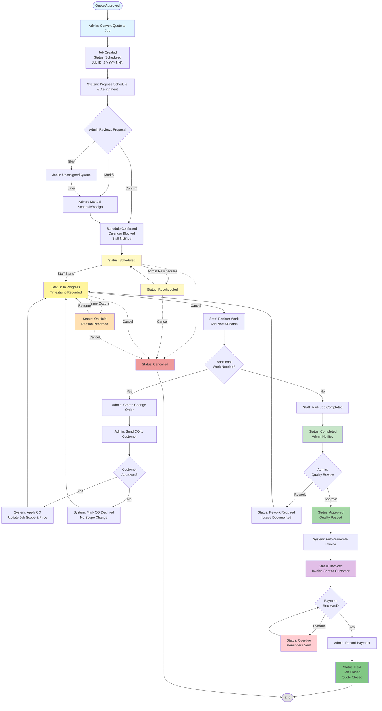
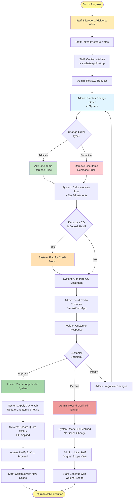
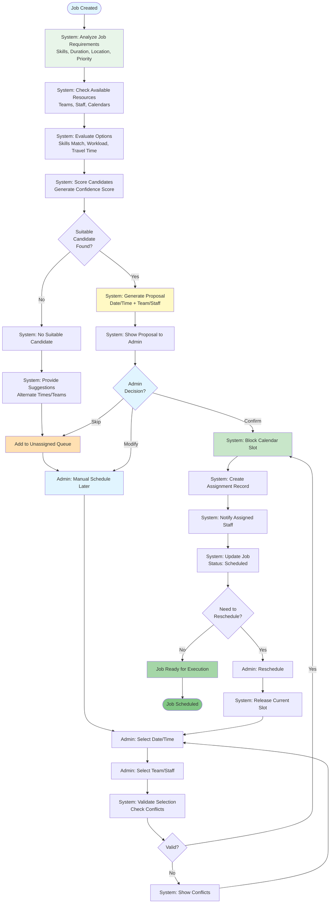
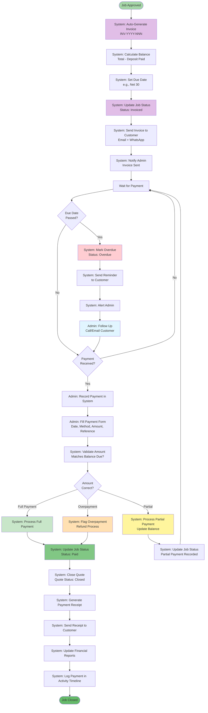
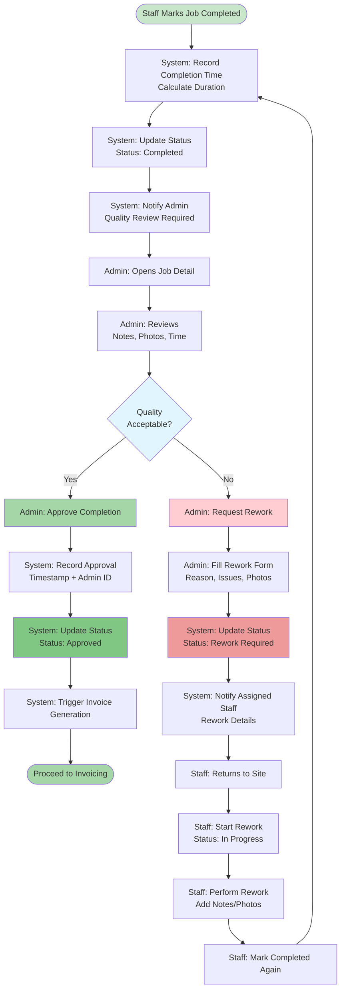
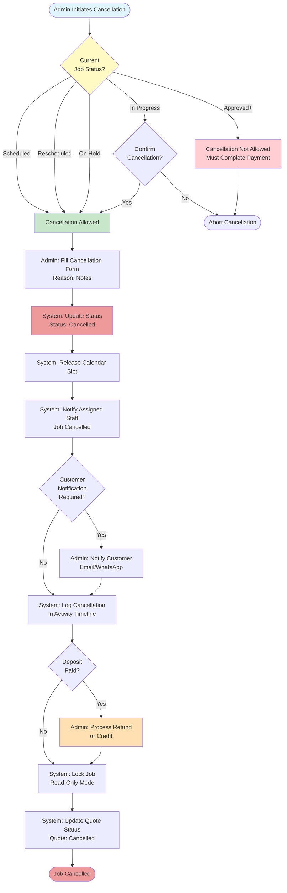

# Job Process Visual Flows

## Complete Job Lifecycle Diagram

---

## Change Order Detailed Flow

---

## Scheduling & Assignment Flow

---

## Payment & Invoicing Flow

---

## Quality Control Flow

---

## Job Cancellation Flow

---

## Document Version

- **Version:** 1.0
- **Date:** November 6, 2024
- **Companion to:** JOB_PROCESS_DESIGN.md
