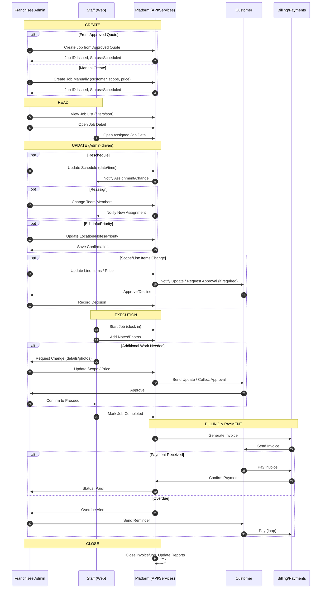
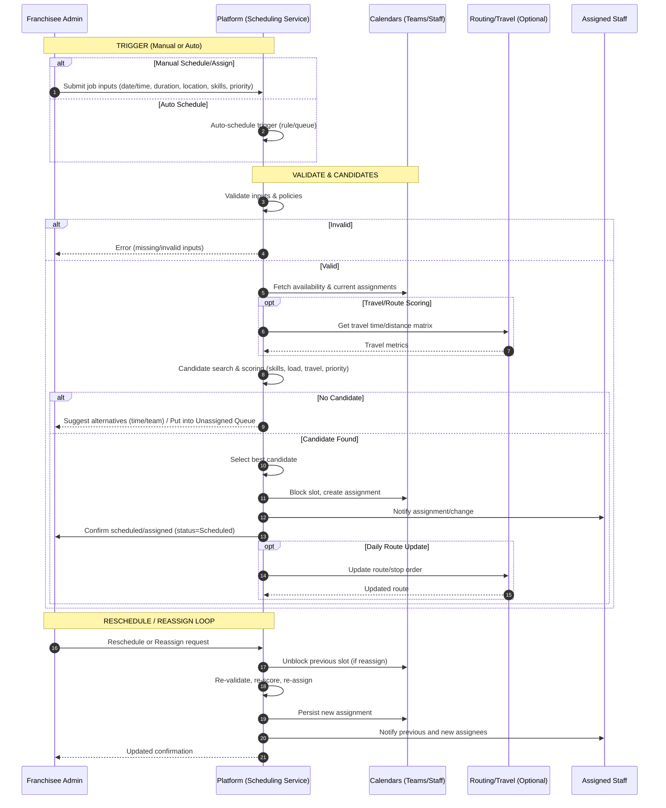

# Job Management: CRUD & Operational Flow

This flow focuses on how franchisee admins and staff create, read, update, and manage jobs from scheduling through completion. It aligns with statuses defined in `job_management_overview.md` and the UI in `job_list.html` / `job_detail.html`.

```mermaid
flowchart TD
    Start([Start])

    %% CREATE
    C0{Job Source}
    C1[Admin: Create from Approved Quote<br/>(auto-fill customer, items, price)]
    C2[Admin: Create Manually<br/>(enter customer, scope, price)]
    C3[System: Assign Job ID & Initial Status = Scheduled]

    %% READ
    R1[Admin: View Job List<br/>(filters: status, team, date, search, sort)]
    R2[Admin/Staff: View Job Detail]

    %% UPDATE - CORE
    U0{Need to Update?}
    U1[Reschedule Date/Time]
    U2[Reassign Team/Members]
    U3[Edit Job Info<br/>(location, notes, priority)]
    U4[Change Scope/Line Items<br/>(pricing updates)]
    U5[Update Status]

    %% STATUS PATH
    S0[Status: Scheduled]
    S1[Status: In Progress]
    S2[Status: On Hold]
    S3[Status: Completed]
    S4[Status: Invoiced]
    S5[Status: Paid]
    X[Status: Cancelled]

    %% OPERATIONS
    O1[Staff: Start Job (clock in)]
    O2[Staff: Add Notes/Photos]
    O3{Additional Work?}
    O4[Admin: Update Scope & Price]
    O5[System: Notify Customer / Record Approval]
    O6[Staff: Mark Job Completed]

    %% FINANCE
    F1[System: Generate Invoice]
    F2[System: Send Invoice]
    F3{Payment Received?}
    F4[System: Record Payment]
    F5[System: Overdue Alert & Reminder]

    %% FLOW
    Start --> C0
    C0 -->|Approved Quote| C1
    C0 -->|No Quote| C2
    C1 --> C3
    C2 --> C3
    C3 --> S0

    %% READ anytime
    S0 -.-> R1
    R1 --> R2

    %% UPDATE branching
    R2 --> U0
    U0 -->|Yes| U1
    U0 -->|Yes| U2
    U0 -->|Yes| U3
    U0 -->|Yes| U4
    U0 -->|Yes| U5
    U0 -->|No| S0

    %% Status transitions
    S0 -->|Start Job| S1
    S1 -->|Pause| S2
    S2 -->|Resume| S1
    S1 -->|Work Done| S3
    S0 -->|Cancel| X
    S1 -->|Cancel (if allowed)| X

    %% Operations during execution
    S1 --> O1
    O1 --> O2
    O2 --> O3
    %% Change Order branch (add or deduct)
    O3 -->|Yes| CO0[Admin: Create Change Order (add/deduct)]
    CO0 --> CO1[System: CO Draft (items, totals, tax)]
    CO1 --> CO2[Admin: Send CO to Customer]
    CO2 --> CO3A{Customer Approves CO?}
    CO3A -->|Yes| COA[System: Apply CO to Job<br/>(update items & totals)]
    COA --> S1
    CO3A -->|No| COB[System: Mark CO Declined<br/>(no scope change)]
    COB --> S1
    %% No additional work
    O3 -->|No| O6
    O6 --> S3

    %% Billing
    S3 --> F1
    F1 --> F2
    F2 --> S4
    S4 --> F3
    F3 -->|Yes| F4
    F4 --> S5
    F3 -->|No| F5
    F5 --> S4

    %% End states
    S5 --> End([End: Job Closed])
    X --> End

    %% Styling
    classDef admin fill:#e1f5ff,stroke:#01579b,stroke-width:2px
    classDef staff fill:#f3e5f5,stroke:#4a148c,stroke-width:2px
    classDef system fill:#e8f5e9,stroke:#1b5e20,stroke-width:2px
    classDef status fill:#fff9c4,stroke:#f57f17,stroke-width:2px

    class C1,C2,R1,R2,U1,U2,U3,U4,U5,CO0,CO2 admin
    class O1,O2,O6 staff
    class C3,F1,F2,F4,F5,CO1,COA,COB system
    class S0,S1,S2,S3,S4,S5,X status
```

## Notes
- Create can originate from an approved quote or manual entry.
- Read (list/detail) is available throughout for monitoring and actions.
- Update covers reschedule, reassign, info/priority edits, scope changes, and status moves.
- Manage execution includes starting work, adding notes/photos, handling additional work, and completing the job.
- Cancel is a business action (preferred over hard delete) for auditability.
- Invoicing and reminders follow completion; payment closes the job.

## Sequence Diagram Version



## System Flow: RUD (Read, Update, Delete/Cancel)

```mermaid
flowchart LR
    %% READ
    L0[Admin opens Job List]
    F[Filters: status/team/date/search/sort]
    L1[System: Apply Filters & Pagination]
    L2[Admin selects a Job]
    D1[System: Load Job Detail]

    %% UPDATE DECISIONS
    UQ{Update Type?}
    U1[Reschedule]
    U2[Reassign Team/Members]
    U3[Edit Fields<br/>(location, notes, priority)]
    U4[Change Scope/Line Items]
    U5[Move Status]
    U6[Cancel Job]

    %% UPDATE FLOWS
    RS[System: Validate calendar & persist schedule]
    RA[System: Persist assignment & notify staff]
    EF[System: Persist edited fields]
    SC[System: Recalculate totals; flag approval if required]
    ST[System: Enforce valid status transition]
    CN[System: Set status=Cancelled; lock execution]

    %% READ FLOW
    L0 --> F --> L1 --> L2 --> D1 --> UQ

    %% UPDATE FLOWS OUTCOMES
    UQ -->|Reschedule| U1 --> RS --> D1
    UQ -->|Reassign| U2 --> RA --> D1
    UQ -->|Edit Fields| U3 --> EF --> D1
    UQ -->|Scope/Items| U4 --> SC --> D1
    UQ -->|Status| U5 --> ST --> D1
    UQ -->|Cancel| U6 --> CN --> D1

    %% GUARDS
    classDef system fill:#e8f5e9,stroke:#1b5e20,stroke-width:2px
    classDef admin fill:#e1f5ff,stroke:#01579b,stroke-width:2px
    class L0,F,L1,L2,D1,UQ,U1,U2,U3,U4,U5,U6 admin
    class RS,RA,EF,SC,ST,CN system
```

## Job Statuses (System)
- Scheduled: default after creation; can move to In Progress or Cancelled.
- In Progress: active execution; can move to On Hold, Completed, or Cancelled (policy-driven).
- On Hold: paused; can resume to In Progress or cancel.
- Completed: work done; triggers invoicing.
- Invoiced: invoice generated/sent; awaits payment.
- Paid: payment received; job closed.
- Cancelled: terminal non-execution state; job read-only except metadata.

## System Flow: Scheduling & Assignment

```mermaid
flowchart LR
    %% INPUTS
    I0[Job Inputs<br/>• Date/Time or Window<br/>• Duration<br/>• Location<br/>• Required Skills<br/>• Priority]
    I1[Team/Staff Calendars<br/>• Availability<br/>• Current Assignments]
    I2[Constraints & Policies<br/>• Skills match<br/>• Capacity (daily/weekly hours)<br/>• Overtime rules<br/>• Blackout dates]
    I3[(Optional) Travel Data<br/>• Travel times/distances]

    %% TRIGGER
    T0{Trigger}
    A0[Admin: Schedule/Assign]
    A1[System: Auto-Schedule]

    %% VALIDATION & CANDIDATES
    V0[System: Validate Inputs]
    V1{Valid?}
    E0[Error: Missing/invalid inputs]
    C0[System: Find Candidate Teams/Staff]
    C1[System: Score Candidates<br/>• Availability fit<br/>• Skills fit<br/>• Travel time/route fit<br/>• Load balance<br/>• Priority]
    C2{Any Candidate?}

    %% SELECTION & ASSIGNMENT
    S0[System: Select Best Candidate]
    S1[System: Create Assignment
        • Assign team/members
        • Block calendar
        • Link job to assignee]
    N0[System: Notify Staff (assignment/change)]
    J0[System: Update Job to Scheduled
        • AssignedTeam/Members
        • ScheduleDate/Time]
    R0[(Optional) System: Update Daily Route
        • Optimize stop order]

    %% NO CANDIDATE / CONFLICT HANDLING
    H0[System: Conflict/No-Capacity Suggestions
        • Alternate times
        • Alternate team
        • Split work]
    Q0[System: Put in Unassigned Queue / Waitlist]

    %% RESCHEDULE/REASSIGN LOOP
    L0{Change Needed?}
    L1[Admin: Reschedule]
    L2[Admin: Reassign]
    L3[System: Re-validate, Re-score, Re-assign]
    N1[System: Notify Previous & New Assignees]

    %% FLOW
    I0 --> V0
    I1 --> C0
    I2 --> C0
    I3 --> C1
    T0 -->|Manual| A0 --> V0
    T0 -->|Auto| A1 --> V0
    V0 --> V1
    V1 -->|No| E0
    V1 -->|Yes| C0 --> C1 --> C2
    C2 -->|No| H0 --> Q0
    C2 -->|Yes| S0 --> S1 --> N0 --> J0 --> R0
    R0 --> L0
    J0 --> L0
    L0 -->|No| EndSched([End: Scheduled/Assigned])
    L0 -->|Yes| L1 --> L3 --> N1 --> J0
    L0 -->|Yes| L2 --> L3 --> N1 --> J0

    %% STYLING
    classDef system fill:#e8f5e9,stroke:#1b5e20,stroke-width:2px
    classDef admin fill:#e1f5ff,stroke:#01579b,stroke-width:2px
    class I0,I1,I2,I3,T0,C0,C1,S0,S1,N0,J0,R0,H0,Q0,L0,L3,N1,V0,V1,E0 system
    class A0,A1,L1,L2 admin
```

### Sequence Diagram: Scheduling & Assignment



