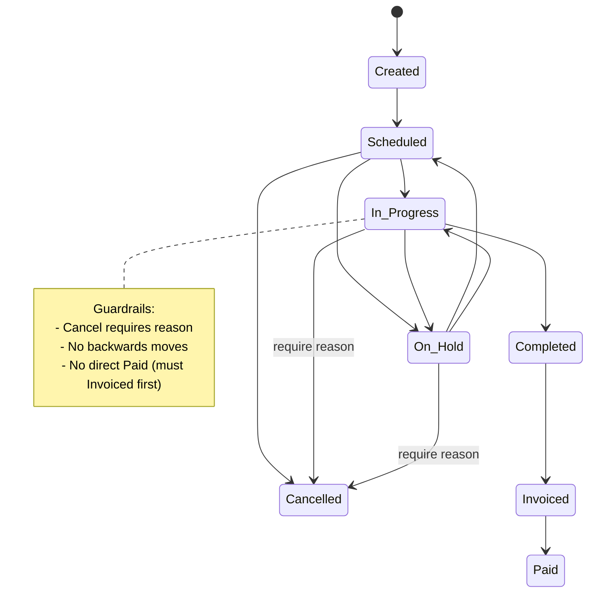

# Job Statuses & Allowed Transitions

This document defines the job statuses, allowed transitions, and key guardrails.

## Statuses
- Created (Unscheduled)
- Scheduled
- In Progress
- On Hold
- Completed
- Invoiced
- Paid
- Cancelled

## State Diagram

## Guardrails (summary)
- Cancel requires a reason when status is In Progress or On Hold.
- No backward transitions (e.g., not Completed → In Progress).
- Must pass through Invoiced before Paid.

## Activities and Requirements for Status Changes

**Legend**: 🖐️ = Manual activity (user does not interact with system)

| From            | To           | Activity / Action                          | Confirmation / Evidence         | Notification          |
|-----------------|--------------|--------------------------------------------|--------------------------------|-----------------------|
| Created         | Scheduled    | Admin confirms/modifies schedule/assignee  | Admin UI action and timestamp  | Staff (assignment)
| Scheduled       | In Progress  | Staff starts job (clock in)                | Staff action + system log      | Admin (timeline)
| Scheduled       | On Hold      | Admin/Staff pauses before work starts      | Admin reason required          | Staff, Admin
| Scheduled       | Cancelled    | Admin cancels before work starts           | Reason if policy; 🖐️ supervisor approval for late cancels | 🖐️ Staff, Admin
| In Progress     | On Hold      | Staff/Admin pauses active job              | Reason (field or office)       | Admin, Staff
| In Progress     | Completed    | Staff marks job complete                   | Job tasks/checklist complete   | Admin (timeline)
| In Progress     | Cancelled    | 🖐️ Supervisor reviews and confirms cancel | Mandatory cancel reason        | 🖐️ Staff, Admin
| On Hold         | Scheduled    | Admin reschedules after hold               | New date/time selected         | Staff (new assignment)
| On Hold         | In Progress  | Work resumes (un-pause)                    | Staff/Admin action             | Admin (timeline)
| On Hold         | Cancelled    | 🖐️ Supervisor/admin confirms cancel       | Mandatory cancel reason        | 🖐️ Staff, Admin
| Completed       | Invoiced     | Admin reviews and generates invoice        | Invoice record (system)        | 🖐️ Customer (send via Email/WhatsApp)
| Invoiced        | Paid         | 🖐️ Payment received/recorded              | Payment entry (system)         | Admin, Finance

**Legend**:
- 🖐️ **Manual Activity**: User does not interact with the system (e.g., phone call, WhatsApp, in-person approval)
- **System Activity**: User interacts directly with the platform (e.g., clicks button, enters data in UI)
- "Reason required": must store a note for why (e.g., cancelled, pause)
- "Supervisor" means 2nd party approval required for that status change
- "Notification" column lists who is notified or records updated
