# Quote & Job Status Transition Flow

This document illustrates the status lifecycle of Quotes and Jobs, showing how activities trigger status changes throughout the end-to-end process.

**Legend**: 🖐️ = Manual activity (user does not interact with system)

## Status Transition Sequence Diagram

```mermaid
sequenceDiagram
  autonumber
  participant Admin as Franchisee Admin
  participant Customer
  participant System as Platform
  participant Staff
  
  Note over System: QUOTE STATUS: Draft
  Admin->>System: Create Quote
  System-->>Admin: Quote created (Status: Draft)
  
  Note over System: QUOTE STATUS: Sent
  Admin->>System: Send Quote to Customer
  System->>Customer: Deliver Quote (Email/WhatsApp)
  System-->>Admin: Quote Status → Sent
  
  Note over Customer,Admin: CUSTOMER REVIEW PHASE
  alt Customer Approves Quote
    Customer->>Admin: 🖐️ Approve Quote (via Email/WhatsApp)
    Admin->>System: Record Approval
    Note over System: QUOTE STATUS: Approved
    System-->>Admin: Quote Status → Approved
    
    Note over System: JOB STATUS: Scheduled (default)
    Admin->>System: Convert Quote to Job
    System-->>Admin: Job created (Status: Scheduled)
    
  else Customer Requests Changes
    Customer->>Admin: 🖐️ Request Changes (via Email/WhatsApp)
    Admin->>System: Update Quote
    Note over System: QUOTE STATUS: Under Revision
    System-->>Admin: Quote Status → Under Revision
    System->>Admin: Generate Updated Quote
    Admin->>System: Resend Updated Quote
    Note over System: QUOTE STATUS: Sent
    System->>Customer: Deliver Updated Quote
    System-->>Admin: Quote Status → Sent
    
  else Customer Declines
    Customer->>Admin: 🖐️ Decline Quote (via Email/WhatsApp)
    Admin->>System: Record Decline
    Note over System: QUOTE STATUS: Declined
    System-->>Admin: Quote Status → Declined (End)
    
  else No Response (Timeout)
    Note over System: QUOTE STATUS: Expired
    System->>Admin: Auto-expire after timeout period
    System-->>Admin: Quote Status → Expired (End)
  end
  
  Note over Admin,Staff: SCHEDULING & ASSIGNMENT PHASE
  Note over System: JOB STATUS: Scheduled
  Admin->>System: Schedule Job & Assign Staff
  System->>Calendar: Block time slot
  System->>Staff: Send Assignment Notification
  System-->>Admin: Job Status → Scheduled (confirmed)
  
  opt Admin Reschedules
    Admin->>System: Update Schedule
    Note over System: JOB STATUS: Rescheduled
    System->>Calendar: Update time slot
    System->>Staff: Notify Schedule Change
    System-->>Admin: Job Status → Rescheduled
  end
  
  opt Admin Reassigns
    Admin->>System: Change Assigned Staff
    System->>Staff: Notify New Assignment
    System-->>Admin: Job Status remains Scheduled
  end
  
  Note over Staff,System: JOB EXECUTION PHASE
  Note over System: JOB STATUS: In Progress
  Staff->>System: Start Job (Check-in)
  System-->>Staff: Job Status → In Progress
  System-->>Admin: Notify Job Started
  
  opt Change Order Required
    Staff->>Admin: 🖐️ Request Additional Work (via WhatsApp)
    Note over System: QUOTE STATUS: Change Order Pending
    Admin->>System: Create Change Order
    System-->>Admin: CO created (linked to original Quote)
    Admin->>Customer: Send Change Order for Approval
    
    alt Customer Approves Change Order
      Customer->>Admin: 🖐️ Approve CO (via Email/WhatsApp)
      Admin->>System: Record CO Approval
      Note over System: QUOTE STATUS: Approved (CO applied)
      System->>System: Update Job Scope & Price
      System-->>Admin: Quote & Job updated with CO
      Admin->>Staff: 🖐️ Confirm to Proceed (via WhatsApp)
      
    else Customer Declines Change Order
      Customer->>Admin: 🖐️ Decline CO (via Email/WhatsApp)
      Admin->>System: Record CO Decline
      Note over System: QUOTE STATUS: Approved (original scope)
      System-->>Admin: CO marked Declined
      Admin->>Staff: 🖐️ Continue with Original Scope (via WhatsApp)
    end
  end
  
  Staff->>System: Upload Photos & Notes
  Staff->>System: Mark Job Completed
  Note over System: JOB STATUS: Completed
  System-->>Staff: Job Status → Completed
  System-->>Admin: Notify Job Completed
  
  Note over Admin,System: QUALITY CONTROL PHASE
  alt Quality Check Passes
    Admin->>System: Approve Completion
    Note over System: JOB STATUS: Approved
    System-->>Admin: Job Status → Approved
    
  else Quality Issues Found
    Admin->>System: Flag for Rework
    Note over System: JOB STATUS: Rework Required
    System-->>Admin: Job Status → Rework Required
    Admin->>Staff: 🖐️ Request Rework (via WhatsApp)
    Staff->>System: Start Rework
    Note over System: JOB STATUS: In Progress
    System-->>Admin: Job Status → In Progress
    Staff->>System: Complete Rework
    Note over System: JOB STATUS: Completed
    System-->>Admin: Job Status → Completed
    Admin->>System: Approve Completion
    Note over System: JOB STATUS: Approved
    System-->>Admin: Job Status → Approved
  end
  
  Note over System,Customer: INVOICING & PAYMENT PHASE
  Note over System: JOB STATUS: Invoiced
  System->>System: Auto-Generate Invoice
  System->>Customer: Send Invoice (Email/WhatsApp)
  System-->>Admin: Job Status → Invoiced
  
  alt Payment Received
    Customer->>Admin: 🖐️ Make Payment (Bank Transfer/Cash)
    Admin->>System: Record Payment
    Note over System: JOB STATUS: Paid
    System-->>Admin: Job Status → Paid
    Note over System: QUOTE STATUS: Closed
    System-->>Admin: Quote Status → Closed (End)
    
  else Payment Overdue
    System->>Admin: Alert Overdue Payment
    Note over System: JOB STATUS: Overdue
    System-->>Admin: Job Status → Overdue
    Admin->>Customer: 🖐️ Send Payment Reminder (via Email/WhatsApp)
    Customer->>Admin: 🖐️ Make Payment (Bank Transfer/Cash)
    Admin->>System: Record Payment
    Note over System: JOB STATUS: Paid
    System-->>Admin: Job Status → Paid
    Note over System: QUOTE STATUS: Closed
    System-->>Admin: Quote Status → Closed (End)
  end
  
  Note over Admin,System: CANCELLATION (Optional)
  opt Job Cancelled
    Admin->>System: Cancel Job
    Note over System: JOB STATUS: Cancelled
    System->>Calendar: Release time slot
    System->>Staff: Notify Cancellation
    System-->>Admin: Job Status → Cancelled (End)
    Note over System: QUOTE STATUS: Cancelled
    System-->>Admin: Quote Status → Cancelled (End)
  end
```

---

## Quote Status Definitions & Trigger Activities

| Status | Description | Triggered By (🖐️ = Manual) |
|--------|-------------|--------------|
| **Draft** | Quote is being created but not yet sent | Admin creates new quote |
| **Sent** | Quote has been delivered to customer | Admin sends quote to customer |
| **Under Revision** | Customer requested changes, quote being updated | 🖐️ Admin updates quote based on customer feedback |
| **Approved** | Customer has approved the quote | 🖐️ Admin records customer approval (via Email/WhatsApp) |
| **Declined** | Customer has rejected the quote | 🖐️ Admin records customer decline (via Email/WhatsApp) |
| **Expired** | Quote validity period has passed without response | System auto-expires after timeout (e.g., 30 days) |
| **Change Order Pending** | Additional work requested during job execution | 🖐️ Staff requests change order (via WhatsApp); Admin creates CO |
| **Closed** | Quote lifecycle complete (job paid) | System closes quote after final payment received |
| **Cancelled** | Quote/Job cancelled before completion | Admin cancels job |

---

## Job Status Definitions & Trigger Activities

| Status | Description | Triggered By (🖐️ = Manual) |
|--------|-------------|--------------|
| **Scheduled** | Job created and scheduled with assigned staff | Admin converts approved quote to job; Admin schedules job |
| **Rescheduled** | Job date/time has been changed | Admin updates job schedule |
| **In Progress** | Staff has started working on the job | Staff checks in and starts job |
| **Completed** | Staff has finished work and marked job complete | Staff marks job as completed |
| **Rework Required** | Quality check failed, work needs correction | 🖐️ Admin flags job for rework after review (via WhatsApp) |
| **Approved** | Job completion approved by admin | Admin approves completed job after quality check |
| **Invoiced** | Invoice generated and sent to customer | System auto-generates invoice after job approval |
| **Overdue** | Payment deadline has passed | System detects overdue payment |
| **Paid** | Customer payment received and recorded | 🖐️ Admin records payment in system (Bank Transfer/Cash) |
| **Cancelled** | Job cancelled before completion | Admin cancels job |

---

## Activity-to-Status Change Matrix

### Quote Activities

| Activity (🖐️ = Manual) | Actor | From Status | To Status |
|----------|-------|-------------|-----------|
| Create Quote | Admin | - | Draft |
| Send Quote | Admin | Draft | Sent |
| Resend Quote | Admin | Under Revision | Sent |
| 🖐️ Record Approval | Admin | Sent | Approved |
| Update Quote | Admin | Sent | Under Revision |
| 🖐️ Record Decline | Admin | Sent | Declined |
| Auto-Expire | System | Sent | Expired |
| 🖐️ Create Change Order | Admin | Approved | Change Order Pending |
| 🖐️ Approve Change Order | Admin | Change Order Pending | Approved |
| 🖐️ Decline Change Order | Admin | Change Order Pending | Approved (original) |
| Record Final Payment | System | Approved | Closed |
| Cancel Job | Admin | Any | Cancelled |

### Job Activities

| Activity (🖐️ = Manual) | Actor | From Status | To Status |
|----------|-------|-------------|-----------|
| Convert Quote to Job | Admin | - | Scheduled |
| Schedule Job | Admin | Scheduled | Scheduled (confirmed) |
| Reschedule Job | Admin | Scheduled | Rescheduled |
| Reassign Staff | Admin | Scheduled/Rescheduled | (no change) |
| Start Job | Staff | Scheduled/Rescheduled | In Progress |
| Mark Completed | Staff | In Progress | Completed |
| 🖐️ Flag for Rework | Admin | Completed | Rework Required |
| Start Rework | Staff | Rework Required | In Progress |
| Approve Completion | Admin | Completed | Approved |
| Generate Invoice | System | Approved | Invoiced |
| Detect Overdue | System | Invoiced | Overdue |
| 🖐️ Record Payment | Admin | Invoiced/Overdue | Paid |
| Cancel Job | Admin | Any (pre-completion) | Cancelled |

---

## State Transition Rules

### Quote State Rules
1. **Draft** → Can only move to **Sent**
2. **Sent** → Can move to **Approved**, **Under Revision**, **Declined**, or **Expired**
3. **Under Revision** → Must return to **Sent** before other transitions
4. **Approved** → Can move to **Change Order Pending** or **Closed**
5. **Change Order Pending** → Returns to **Approved** (with or without CO applied)
6. **Declined**, **Expired**, **Closed**, **Cancelled** → Terminal states (no further transitions)

### Job State Rules
1. **Scheduled** → Can move to **Rescheduled**, **In Progress**, or **Cancelled**
2. **Rescheduled** → Can move to **In Progress** or **Cancelled**
3. **In Progress** → Can move to **Completed** or **Cancelled**
4. **Completed** → Can move to **Approved** or **Rework Required**
5. **Rework Required** → Must return to **In Progress**
6. **Approved** → Must move to **Invoiced**
7. **Invoiced** → Can move to **Paid** or **Overdue**
8. **Overdue** → Can move to **Paid**
9. **Paid**, **Cancelled** → Terminal states (no further transitions)

---

## Key Insights

### Quote-Job Relationship
- **One Quote** can generate **One or Multiple Jobs** (if implementing multi-job feature)
- Quote status **Approved** is prerequisite for Job creation
- Job **Change Orders** update the original Quote status temporarily
- Quote reaches **Closed** only when all associated Jobs are **Paid**

### Critical Status Gates
1. **Quote Approval Gate**: Customer must approve before job creation
2. **Quality Gate**: Job must be approved before invoicing
3. **Payment Gate**: Payment must be recorded before quote closure

### Status Monitoring Points
- **Sent → Expired**: Monitor quote age for follow-ups
- **Invoiced → Overdue**: Monitor payment deadlines
- **Completed → Approved**: Monitor quality check turnaround
- **Rework Required → Completed**: Monitor rework completion time
