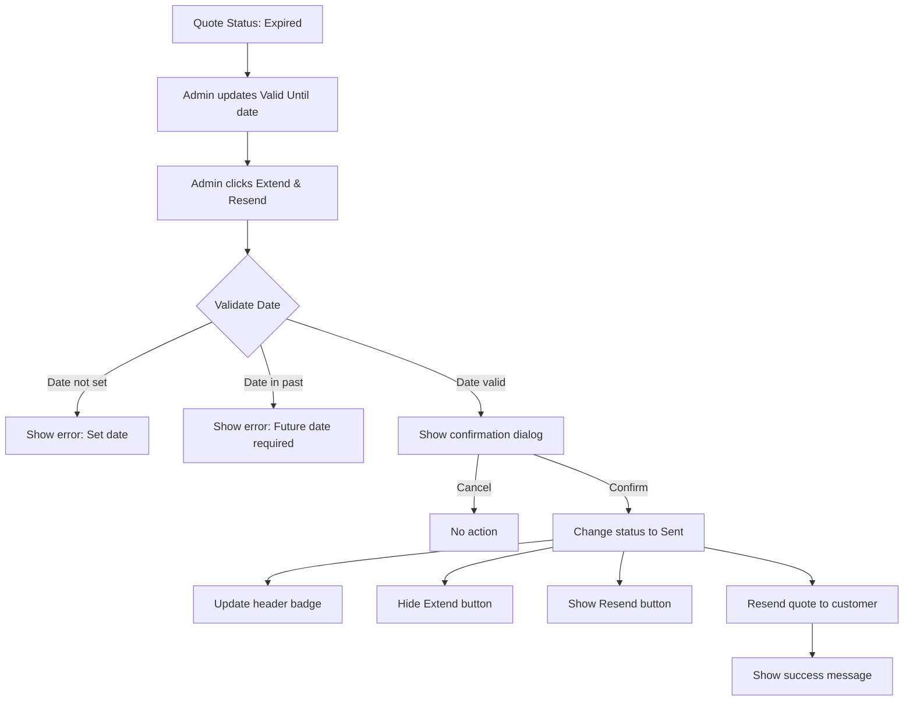
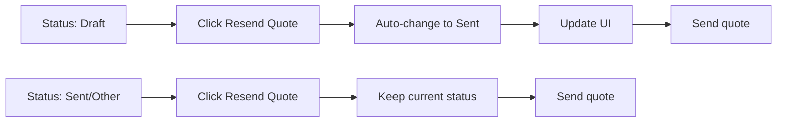

# Quote Edit Page - Implementation Summary

## ✅ Completed Updates (High & Medium Priority)

### **HIGH PRIORITY** ⭐

#### 1. ✅ "Extend & Resend" Button
**Location:** Action buttons section (after "Convert to Job")
- **Color:** Orange (`bg-orange-600`)
- **Icon:** Refresh/reload circular arrows
- **Visibility:** Only visible when `status === 'expired'`
- **Functionality:**
  - Validates "Valid Until" date is set
  - Validates date is in the future
  - Changes status from "Expired" → "Sent"
  - Updates header badge
  - Hides extend button, shows resend button
  - Shows success message with new validity date
  - Logs extension action

#### 2. ✅ Button Visibility Logic for Expired Status
**Implementation:**
```javascript
if (newStatus === 'expired') {
    extendBtn.classList.remove('hidden');
    resendBtn.classList.add('hidden'); // Hide resend when expired
} else {
    extendBtn.classList.add('hidden');
    resendBtn.classList.remove('hidden'); // Show resend for other statuses
}
```

#### 3. ✅ Validity Date Validation
**When:** Before extending quote
- ✅ Checks if date is set
- ✅ Checks if date is in the future
- ✅ Focuses on date field if invalid
- ✅ Shows clear error messages

---

### **MEDIUM PRIORITY** 🔄

#### 4. ✅ Auto-Change Status on "Resend Quote" Click
**Implementation:**
```javascript
// When "Resend Quote" clicked:
if (state.quoteStatus === 'draft') {
    state.quoteStatus = 'sent';
    // Update status dropdown
    // Update header badge
    console.log('Status auto-changed from Draft to Sent');
}
// Then send the quote
```

#### 5. ✅ Expired Quote Warning Banner
**Location:** Above the main content grid
- **Design:** Orange banner with left border
- **Icon:** Clock icon
- **Content:** 
  - "This quote expired on [date]"
  - Clickable link to focus on validity date field
  - Instructions to use "Extend & Resend"
- **Visibility:** Only shows when `status === 'expired'`
- **Auto-updates:** Shows actual expiration date from "Valid Until" field

#### 6. ✅ Status-Specific Button Visibility
**Implemented Matrix:**

| Status | Save Changes | Resend Quote | Download PDF | Convert to Job | Extend & Resend |
|--------|-------------|--------------|--------------|----------------|-----------------|
| Draft | ✅ Show | ✅ Show | ✅ Show | ❌ Hide | ❌ Hide |
| Sent | ✅ Show | ✅ Show | ✅ Show | ❌ Hide | ❌ Hide |
| Accepted | ✅ Show | ✅ Show | ✅ Show | ✅ Show | ❌ Hide |
| Declined | ✅ Show | ✅ Show | ✅ Show | ❌ Hide | ❌ Hide |
| Expired | ✅ Show | ❌ **Hide** | ✅ Show | ❌ Hide | ✅ **Show** |

**Key Changes:**
- "Resend Quote" button **hides** when status is "Expired"
- "Extend & Resend" button **shows** only when "Expired"
- "Convert to Job" button **shows** only when "Accepted"

---

## 📋 Feature Details

### Extend & Resend Workflow



### Auto-Status Change on Resend



---

## 🎨 UI Components Added

### 1. Expired Warning Banner
```html
<div id="expiredWarningBanner" class="hidden bg-orange-50 border-l-4 border-orange-500 p-3 mb-4">
    <div class="flex items-center gap-2">
        <svg class="w-5 h-5 text-orange-600">...</svg>
        <p class="text-sm text-orange-800">
            ⏰ This quote expired on <span id="expiredDateText"></span>. 
            <button>Update validity date</button> and click "Extend & Resend" to reactivate.
        </p>
    </div>
</div>
```

### 2. Extend & Resend Button
```html
<button id="extendResendBtn" class="hidden w-full bg-orange-600 text-white py-2 rounded-lg...">
    <svg>...</svg>
    Extend & Resend
</button>
```

---

## 🔧 JavaScript Functions Added

### 1. Status Change Handler Enhancement
- Added expired banner show/hide logic
- Added extend button visibility logic
- Added resend button conditional visibility

### 2. Resend Quote Handler Enhancement
- Added auto-status change from Draft → Sent
- Updates status dropdown
- Updates header badge
- Logs status change

### 3. Extend & Resend Handler (NEW)
- Validates quote status is "expired"
- Validates validity date is set and in future
- Shows confirmation dialog
- Changes status to "sent"
- Updates all UI elements
- Logs extension action
- Shows success message with details

---

## 📊 Status Transition Updates

### New Transition Added
**Expired → Sent (Extend Validity)**
- **Trigger:** Manual (Admin clicks "Extend & Resend")
- **Validation:** New validity date must be in future
- **Actions:**
  1. Update status to "Sent"
  2. Update header badge
  3. Hide extend button
  4. Show resend button
  5. Hide expired warning banner
  6. Resend quote to customer

### Enhanced Transition
**Draft → Sent (Auto on Resend)**
- **Trigger:** Auto when "Resend Quote" clicked
- **Actions:**
  1. Auto-change status to "Sent"
  2. Update status dropdown
  3. Update header badge
  4. Send quote to customer

---

## 🧪 Testing Checklist

### Test Expired Quote Workflow
- [ ] Set quote status to "Expired"
- [ ] Verify orange warning banner appears
- [ ] Verify "Extend & Resend" button is visible
- [ ] Verify "Resend Quote" button is hidden
- [ ] Click "Update validity date" link - should focus on date field
- [ ] Try extending without setting date - should show error
- [ ] Try extending with past date - should show error
- [ ] Set future date and click "Extend & Resend"
- [ ] Verify confirmation dialog appears
- [ ] Confirm extension
- [ ] Verify status changes to "Sent"
- [ ] Verify header badge updates
- [ ] Verify warning banner disappears
- [ ] Verify "Extend & Resend" button hides
- [ ] Verify "Resend Quote" button shows

### Test Auto-Status Change
- [ ] Create quote with status "Draft"
- [ ] Click "Resend Quote" button
- [ ] Verify status auto-changes to "Sent"
- [ ] Verify header badge updates to blue "Sent"
- [ ] Verify status dropdown shows "Sent"

### Test Button Visibility
- [ ] Test each status (Draft, Sent, Accepted, Declined, Expired)
- [ ] Verify correct buttons show/hide per status
- [ ] Verify "Convert to Job" only shows for "Accepted"
- [ ] Verify "Extend & Resend" only shows for "Expired"
- [ ] Verify "Resend Quote" hides for "Expired"

---

## 📝 Code Locations

### HTML Changes
- **Line ~71-84:** Expired warning banner
- **Line ~466-476:** Extend & Resend button

### JavaScript Changes
- **Line ~1550-1570:** Status change handler (button visibility logic)
- **Line ~1735-1747:** Resend quote handler (auto-status change)
- **Line ~1782-1830:** Extend & Resend handler (new)

---

## 🚀 Next Steps (Low Priority - Future)

1. **Status History Tracking**
   - Track all status changes with timestamps
   - Show timeline in UI
   - Record which admin made changes

2. **Enhanced Customer Feedback**
   - Add feedback section for expired quotes
   - Track follow-up actions
   - Record reasons for no response

3. **Additional Confirmation Dialogs**
   - Warn when changing from "Accepted" to other status
   - Warn when deleting items from "Sent" quote
   - Confirm before major changes

4. **Email/SMS Integration**
   - Actually send emails when resending
   - Send SMS notifications
   - Track delivery status

---

*Implementation completed: November 5, 2025*
*Files modified: quote_edit.html*
*Status: ✅ Ready for testing*
