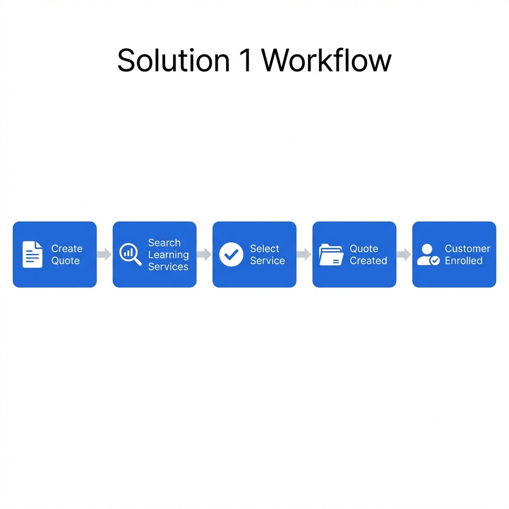
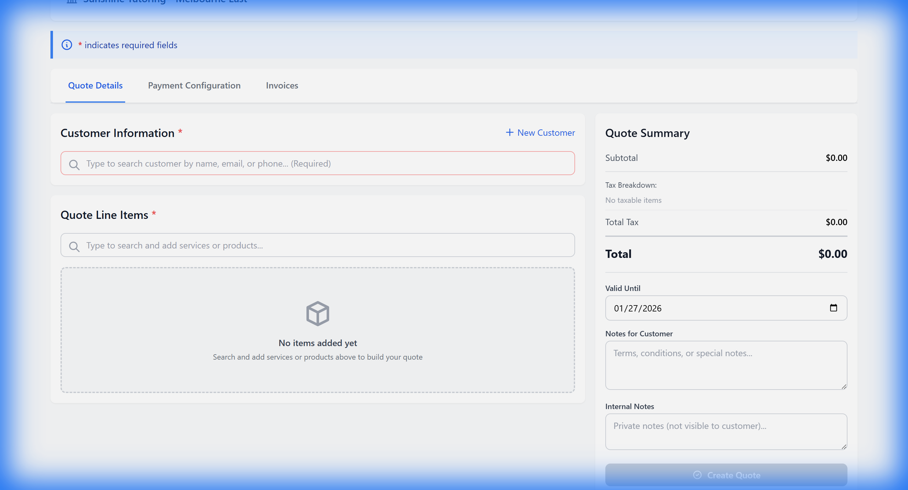
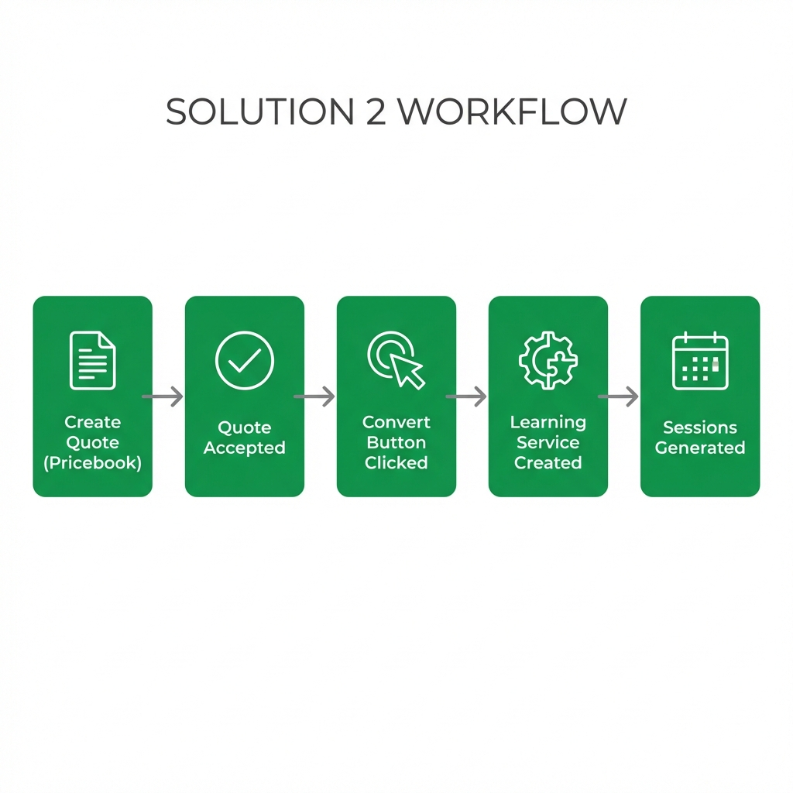
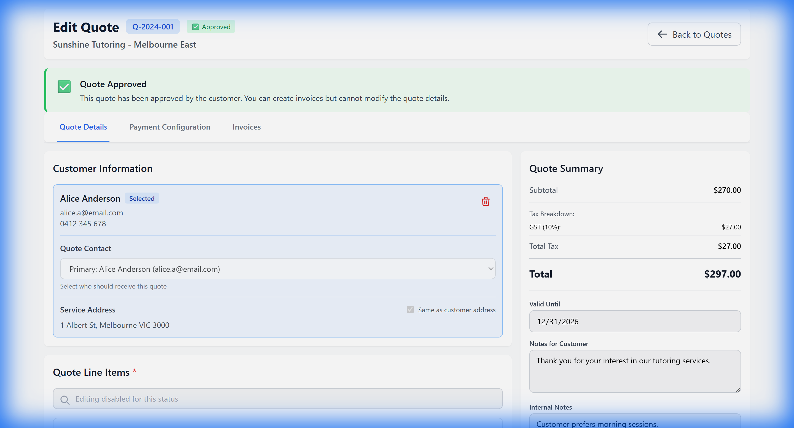
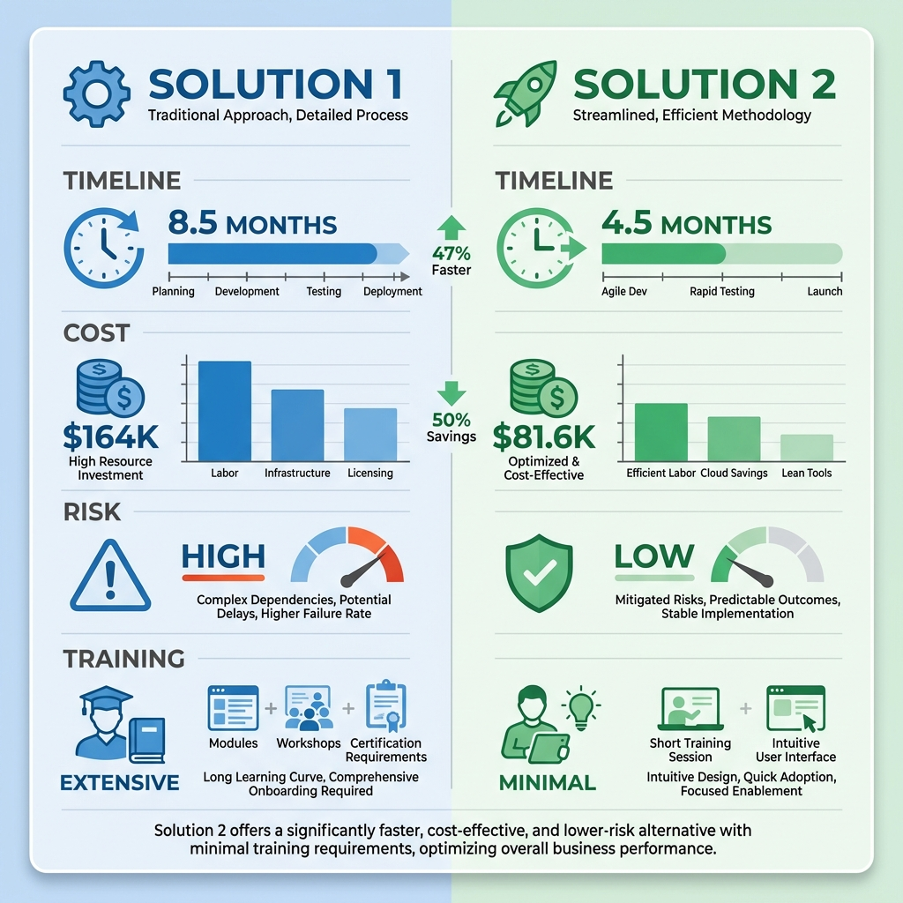

# Quote Line Items: Two Solutions Comparison

**Version:** 1.0  
**Date:** January 13, 2026  
**Purpose:** Choose how to connect Quotes to Learning Service Sessions

---

## I. PROBLEM STATEMENT

**Current Situation:**
- Quotes use **Pricebook Items** (catalog of services/products with prices)
- After quote acceptance, operations must **manually create** Learning Services and Sessions
- No automatic link between what was sold and what gets delivered

**Business Need:**  
Connect quotes to actual service delivery (Learning Service Sessions)

---

## II. PROPOSED SOLUTIONS

### Solution 1: Search Learning Services Directly
**Core Concept:** Replace pricebook search with Learning Service search when creating quotes

### Solution 2: Convert Button
**Core Concept:** Keep pricebook, add a "Convert to Sessions" button after quote acceptance

---

## III. SOLUTION 1: SEARCH LEARNING SERVICES

### Implementation Approach
1. Sales creates quote
2. Instead of searching pricebook, **searches Learning Services directly**
3. Selects existing Learning Service (e.g., "Math Tutoring - Group")
4. Quote shows service details and pricing
5. Customer accepts
6. Sessions already exist → just enroll customer

### Process Flow

### Current UI - Where Changes Apply

**Quote Line Items Section** (where pricebook search will be replaced):

*In Solution 1, the search bar shown above will be changed from "Search pricebook items" to "Search Learning Services". Users will select existing Learning Services instead of pricebook items.*

### Advantages
- Direct connection (no middle layer)
- Simpler long-term (one system instead of two)
- Real-time service availability
- No duplicate data

### Disadvantages
- **Cannot quote products** (only services)
- **Must create Learning Service first** before quoting
- **Breaks current workflow** (retraining needed)
- **No flexible pricing** (locked to service price)
- **8.5 months development**
- **$164,000 cost**

---

## IV. SOLUTION 2: CONVERT TO SESSIONS BUTTON

### Implementation Approach
1. Sales creates quote **using pricebook** (no change)
2. Customer accepts quote
3. Manager clicks **"Convert to Sessions"** button
4. System creates Learning Service + Sessions automatically
5. Customer enrolled with purchased slots

### Process Flow

### Current UI - Where Changes Apply

**Quote Edit/Detail Screen** (where "Convert to Sessions" button will be added):

*In Solution 2, a new "Convert to Sessions" button will be added to the header area (next to "Back to Quotes") when the quote status is "Accepted". This button will trigger the automatic creation of Learning Services and Sessions.*

**Quote Creation Screen** (remains unchanged):

*The quote creation process stays exactly the same - users continue to search and add pricebook items as they do today.*

### Advantages
- **No workflow changes** (sales process stays same)
- **Can quote products** (pricebook handles both)
- **Flexible pricing** (custom quotes possible)
- **Quote before service exists** (pre-sales flexibility)
- **4.5 months development**
- **$81,600 cost**
- **Low risk** (easy to rollback)

### Disadvantages
- Extra conversion step (one button click)
- Maintains two systems (pricebook + Learning Services)
- Potential for data inconsistency
- More complex long-term maintenance

---

## V. COMPARATIVE ANALYSIS

### Detailed Comparison

| Aspect | Solution 1 | Solution 2 |
|--------|------------|------------|
| **Sales Workflow** | Major changes | No change |
| **Product Quotes** | Not supported | Supported |
| **Development Time** | 8.5 months | 4.5 months |
| **Cost** | $164,000 | $81,600 |
| **Risk** | High | Low |
| **User Training** | Extensive | Minimal |
| **Pricing Flexibility** | Limited | Full |
| **Long-term Simplicity** | Better | Adequate |
| **Can Quote Pre-Service** | No | Yes |
| **Time to Value** | 8.5 months | 1 month (MVP) |

---

## VI. FINANCIAL COMPARISON

| Item | Solution 1 | Solution 2 |
|------|------------|------------|
| **Timeline** | 8.5 months | 4.5 months |
| **Cost** | $164,000 | $81,600 |
| **Risk Buffer** | +$24,800 | +$4,800 |
| **Total** | **$188,800** | **$86,400** |
| **Savings** | - | **$102,400** |

---

## VII. USE CASE ANALYSIS

### When Solution 1 is Appropriate
- Organization **only sells services** (no products)
- All services **already exist** before quoting
- Goal to **eliminate pricebook** completely
- Available **8+ months** for development
- Capacity to **retrain all sales staff**

### When Solution 2 is Appropriate
- Organization **sells both services and products**
- Need to **quote before creating services**
- Require **custom pricing** per quote
- Prefer **fast delivery** (4.5 months)
- Prefer **low-risk changes**

---

## VIII. SCENARIO COMPARISONS

### Scenario A: Standard Service Quote
**Customer Requirement:** Weekly math tutoring

| Solution 1 | Solution 2 |
|------------|------------|
| 1. Search "Math Tutoring" service | 1. Search pricebook "Math Tutoring" |
| 2. Select existing service | 2. Add to quote |
| 3. Create quote | 3. Send quote |
| 4. Customer accepts | 4. Customer accepts |
| 5. Enroll in existing sessions | 5. Click "Convert to Sessions" |
| | 6. Service + sessions created |

**Result:** Solution 1 (1 less step)

### Scenario B: Custom Package Quote
**Customer Requirement:** 10 sessions + 2 textbooks + custom discount

| Solution 1 | Solution 2 |
|------------|------------|
| Cannot quote products | Add all items to quote |
| Cannot customize pricing | Apply custom discount |
| Need separate product quote | One quote for everything |

**Result:** Solution 2 (Solution 1 cannot support this scenario)

### Scenario C: Quote Before Service Exists
**Customer Requirement:** New service not yet created

| Solution 1 | Solution 2 |
|------------|------------|
| Must create service first | Quote from pricebook |
| Then create quote | Create service after acceptance |
| Delays sales process | Faster sales cycle |

**Result:** Solution 2 (more flexible)

---

## IX. IMPLEMENTATION ROADMAP (SOLUTION 2)

If selecting Solution 2, delivery can be phased:

### Phase 1 (1 month) - Minimum Viable Product
- Basic convert button
- Simple 1:1 conversion
- **Value Delivered:** Start using immediately

### Phase 2 (1.5 months) - Enhanced Functionality
- Handle multiple items
- Smart mapping
- **Value Delivered:** Complex quotes supported

### Phase 3 (1 month) - Automation
- Auto-convert option
- Bulk tools
- **Value Delivered:** Streamlined workflow

### Phase 4 (1 month) - Administration
- Configuration UI
- Analytics
- **Value Delivered:** Full control

---

## X. RECOMMENDATION

### **RECOMMENDED SOLUTION: Solution 2 (Convert Button)**

**Justification:**
1. **50% cost reduction** ($81,600 vs $164,000)
2. **4 months faster delivery** (4.5 vs 8.5 months)
3. **No disruption** to current sales process
4. **Supports all scenarios** (services + products)
5. **Lower risk profile** (easy to rollback)
6. **Rapid value delivery** (MVP in 1 month)

### **Future Evolution Strategy**

**Recommended Approach:**
1. **Immediate:** Implement Solution 2 (4.5 months)
2. **6 months post-launch:** Evaluate usage and feedback
3. **If warranted:** Gradually migrate to Solution 1 approach
4. **Alternative:** Enhance Solution 2 with additional automation

**Benefits of This Strategy:**
- Immediate value delivery
- Lower implementation risk
- Flexibility to evolve based on actual usage
- Proof of concept before major investment

---

## XI. FREQUENTLY ASKED QUESTIONS

**Q: Can both solutions be implemented simultaneously?**  
A: Not recommended. Choose one approach to avoid confusion and maintain system consistency.

**Q: What if the wrong solution is selected?**  
A: Solution 2 is easier to modify or reverse. Solution 1 requires more significant changes to undo.

**Q: What is the expected return on investment timeline?**  
A: Solution 2 achieves ROI in approximately 6 months. Solution 1 in approximately 12 months.

**Q: How are existing quotes affected?**  
A: Both solutions have no impact on existing quotes. Changes apply only to new quotes post-implementation.

---

## XII. APPROVAL AND AUTHORIZATION

**Recommended Choice:** ☐ Solution 1 ☑ Solution 2

**Approval Signatures:**

| Role | Name | Date | Signature |
|------|------|------|-----------|
| Product Owner | | | |
| Sales Manager | | | |
| Operations Manager | | | |
| Development Lead | | | |

---

## XIII. NEXT STEPS

**Post-Approval Action Plan:**
1. Kickoff meeting (Week 1)
2. Phase 1 development (Weeks 2-5)
3. User acceptance testing (Week 6)
4. Production rollout (Week 7)
