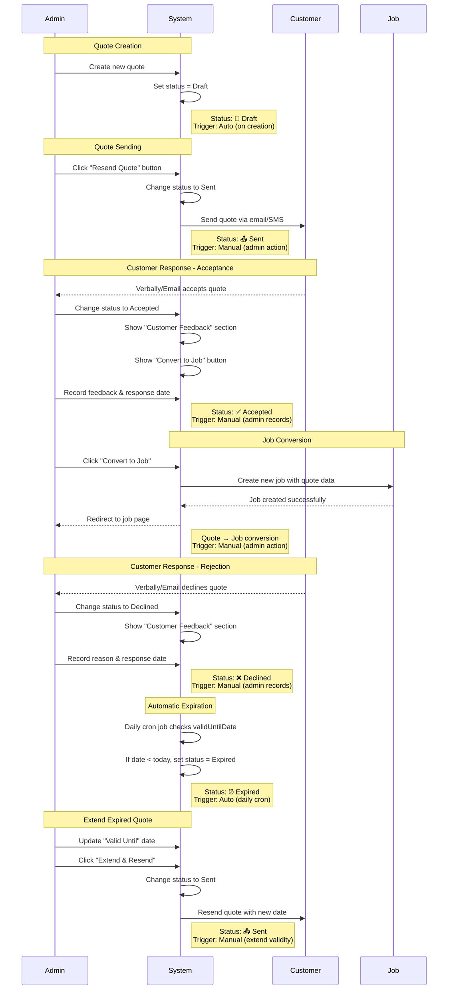

# Quote Status Workflow

## Overview
This document describes the quote status lifecycle and the triggers that cause status transitions in the FMS Quote Management System.

## Status Definitions

| Status | Icon | Description | Color |
|--------|------|-------------|-------|
| **Draft** | 📝 | Quote is being prepared, not yet sent to customer | Yellow |
| **Sent** | 📤 | Quote has been sent to customer, awaiting response | Blue |
| **Accepted** | ✅ | Customer has agreed to the quote | Green |
| **Declined** | ❌ | Customer has rejected the quote | Red |
| **Expired** | ⏰ | Quote validity period has passed | Gray |

---

## Status Flow Diagram



---

## Detailed Status Transitions

### 1. Draft → Sent
**Trigger:** Manual or Automatic
- **Manual:** Admin clicks "Resend Quote" button
- **Automatic:** System when email is successfully sent
- **Action:** Quote is sent to customer via email/SMS
- **Required:** Customer must be selected, items must be added

### 2. Sent → Accepted
**Trigger:** Manual only
- **Action:** Admin records customer's verbal/email acceptance
- **Required:** Admin must fill in:
  - Customer Feedback (optional)
  - Response Date (auto-filled with today's date)
- **Result:** "Convert to Job" button becomes visible

### 3. Sent → Declined
**Trigger:** Manual only
- **Action:** Admin records customer's rejection
- **Required:** Admin should record:
  - Reason for rejection in Customer Feedback
  - Response Date
- **Result:** Quote is closed, no further action

### 4. Sent → Expired
**Trigger:** Automatic (recommended) or Manual
- **Automatic:** Daily cron job checks if `validUntilDate < today`
- **Manual:** Admin manually marks as expired
- **Action:** Quote validity period has passed
- **Result:** Quote can be extended by admin if needed

### 5. Expired → Sent (Extend Validity)
**Trigger:** Manual only
- **Action:** Admin extends the validity period and resends quote
- **Required:** Admin must:
  - Update "Valid Until" date to a future date
  - Click "Extend & Resend" button (appears only when Expired)
- **Process:**
  1. Admin sets new validity date
  2. System changes status back to "Sent"
  3. Quote is resent to customer
- **Result:** Quote becomes active again, customer can respond

### 5. Accepted → Job
**Trigger:** Manual only
- **Action:** Admin clicks "Convert to Job" button
- **Required:** Quote status must be "Accepted"
- **Process:**
  1. System prepares job data from quote
  2. Confirmation dialog shown
  3. New job created with quote items
  4. Job linked to original quote
  5. Redirect to job page
- **Data Transferred:**
  - Customer information
  - All quote items (services/products)
  - Pricing and totals
  - Customer notes

---

## Status Change Rules

### Allowed Transitions

| From Status | To Status | Trigger Type | Admin Action Required |
|-------------|-----------|--------------|----------------------|
| Draft | Sent | Manual/Auto | Click "Resend Quote" |
| Sent | Accepted | Manual | Record customer response |
| Sent | Declined | Manual | Record rejection reason |
| Sent | Expired | Auto/Manual | System cron or admin |
| Expired | Sent | Manual | Update date + Click "Extend & Resend" |
| Accepted | Job | Manual | Click "Convert to Job" |

### Status Properties

| Status | Can Edit Quote | Can Resend | Can Extend Validity | Can Convert to Job | Shows Feedback Section |
|--------|---------------|------------|---------------------|-------------------|----------------------|
| Draft | ✅ Yes | ✅ Yes | ❌ No | ❌ No | ❌ No |
| Sent | ✅ Yes | ✅ Yes | ❌ No | ❌ No | ❌ No |
| Accepted | ✅ Yes | ✅ Yes | ❌ No | ✅ **Yes** | ✅ Yes |
| Declined | ✅ Yes | ✅ Yes | ❌ No | ❌ No | ✅ Yes |
| Expired | ✅ Yes | ✅ Yes | ✅ **Yes** | ❌ No | ❌ No |

---

## Implementation Notes

### Automatic Triggers (Recommended)
1. **New Quote Created** → Status = "Draft" ✅ Implemented
2. **"Resend Quote" Clicked** → Status = "Sent" (if currently Draft) ⚠️ To implement
3. **Daily Cron Job** → Check all "Sent" quotes, if `validUntilDate < today` → Status = "Expired" ⚠️ To implement

### Manual Triggers (Admin Required)
1. **Customer Accepts** → Admin changes to "Accepted" + records feedback ✅ Implemented
2. **Customer Declines** → Admin changes to "Declined" + records reason ✅ Implemented
3. **Convert to Job** → Admin clicks button (only visible when Accepted) ✅ Implemented

### UI Behavior
- **Status Badge:** Updates in real-time in page header
- **Customer Feedback Section:** Appears only for Accepted/Declined status
- **Convert to Job Button:** Appears only for Accepted status
- **Status Dropdown:** Located in Quote Summary sidebar

---

## Example Workflows

### Successful Quote → Job
```
1. Admin creates quote → Status: Draft
2. Admin sends quote → Status: Sent
3. Customer accepts → Admin records → Status: Accepted
4. Admin converts → New job created
```

### Rejected Quote
```
1. Admin creates quote → Status: Draft
2. Admin sends quote → Status: Sent
3. Customer declines → Admin records reason → Status: Declined
```

### Expired Quote
```
1. Admin creates quote → Status: Draft
2. Admin sends quote → Status: Sent
3. No response from customer
4. System checks daily → validUntilDate passed → Status: Expired
```

---

## Technical Details

### State Management
```javascript
state = {
    quoteId: 'Q-2024-001',
    quoteStatus: 'draft', // draft | sent | accepted | declined | expired
    selectedCustomer: {...},
    quoteItems: [...],
    // ... other properties
}
```

### Status Change Handler
```javascript
document.getElementById('quoteStatusSelect').addEventListener('change', function(e) {
    const newStatus = e.target.value;
    state.quoteStatus = newStatus;
    
    // Update header badge
    updateStatusBadge(newStatus);
    
    // Show/hide customer feedback section
    if (newStatus === 'accepted' || newStatus === 'declined') {
        showCustomerFeedbackSection();
    }
    
    // Show/hide Convert to Job button
    if (newStatus === 'accepted') {
        showConvertToJobButton();
    }
});
```

---

## Future Enhancements

1. **Email Tracking:** Track when customer opens quote email → Auto-change to "Viewed" status
2. **Customer Portal:** Allow customers to accept/decline online → Auto-update status
3. **Reminder System:** Auto-send reminder emails before expiration
4. **Status History:** Track all status changes with timestamps and admin names
5. **Bulk Status Updates:** Update multiple quotes at once

---

*Last Updated: November 5, 2025*
