# Quote-to-End Process Flow

This flowchart illustrates the end-to-end process from creating a quote to the completion of the quote lifecycle in the Franchise Management System.

```mermaid
flowchart TD
    Start([Start: New Service Request])
    
    %% QUOTE CREATION & DELIVERY
    A1[Admin: Create Quote in System<br/>using Pricebook<br/>(record customer email/WhatsApp)]
    A2[System: Generate Quote PDF/Link]
    A3[Admin: 🖐️ MANUAL Send Quote<br/>via Email/WhatsApp]
    
    %% QUOTE REVIEW & APPROVAL
    C1[Customer: 🖐️ MANUAL Review Quote<br/>via Email/WhatsApp]
    C2{Customer Response?}
    C3[Customer: 🖐️ MANUAL Approve<br/>via Email/WhatsApp]
    C4[Customer: 🖐️ MANUAL Request Changes<br/>via Email/WhatsApp]
    C5[Admin: 🖐️ MANUAL Send Follow-up<br/>via Email/WhatsApp]
    A4[Admin: Record Approval &<br/>Convert to Work Order]
    A5[Admin: Update Quote in System]
    
    %% SCHEDULING & ASSIGNMENT
    A6[Admin: Schedule Job &<br/>Assign Staff in System]
    S1[System: Send Assignment<br/>Notification to Staff]
    ST1{Staff: Problem<br/>with Assignment?}
    ST2[Staff: 🖐️ MANUAL Report Issue<br/>to Admin via WhatsApp]
    A7[Admin: Reassign to<br/>Another Staff]
    
    %% JOB EXECUTION
    ST3[Staff: Login to Web Dashboard<br/>& Start Job]
    ST4[Staff: 🖐️ MANUAL Communicate<br/>with Admin via WhatsApp]
    ST5{Staff: Additional<br/>Work Needed?}
    ST6[Staff: 🖐️ MANUAL Request Quote Change<br/>via WhatsApp with photos]
    A8[Admin: Update Quote<br/>with Additional Items]
    A9[Admin: Update Quote<br/>with Additional Items]
    SU[System: Auto-Send Updated Quote<br/>via Email/WhatsApp]
    C6[Customer: 🖐️ MANUAL Approve<br/>Additional Work]
    A10[Admin: Record Approval &<br/>Update Work Order]
    A11[Admin: 🖐️ MANUAL Confirm to Staff<br/>via WhatsApp]
    ST7[Staff: Upload Before/After Photos<br/>via Web Dashboard]
    ST8[Staff: Mark Job Completed<br/>in System]
    
    %% QUALITY CONTROL
    S2{System: Job Quality<br/>Check}
    A12[Admin: 🖐️ MANUAL Discuss Issue<br/>with Staff via WhatsApp]
    A13[Admin: Reassign or<br/>Schedule Rework]
    
    %% INVOICING & PAYMENT
    S3[System: Auto-Generate Invoice]
    S4[System: Provide Invoice<br/>PDF/Link to Admin]
    SI[System: Auto-Send Invoice<br/>via Email/WhatsApp]
    C7[Customer: 🖐️ MANUAL Make Payment<br/>or Notify Payment]
    A15[Admin: Record Payment<br/>in System]
    S5{Payment<br/>Received?}
    S6[System: Alert Admin<br/>of Overdue Invoice]
    A16[Admin: 🖐️ MANUAL Send Payment<br/>Reminder via Email/WhatsApp]
    
    %% CLOSURE & REPORTING
    S7[System: Confirm Payment<br/>& Close Invoice]
    A17[Admin: 🖐️ MANUAL Send Thank You<br/>& Request Feedback]
    S8[System: Aggregate Data for<br/>Reporting & Royalty]
    
    End([End: Job Complete])
    
    %% Flow connections
    Start --> A1
    A1 --> A2
    A2 --> SQ
    SQ --> C1
    C1 --> C2
    C2 -->|Approves| C3
    C2 -->|Requests Changes| C4
    C2 -->|No Response| C5
    C3 --> A4
    C4 --> A5
    A5 --> A2
    C5 --> C1
    A4 --> A6
    A6 --> S1
    S1 --> ST1
    ST1 -->|Yes| ST2
    ST1 -->|No| ST3
    ST2 --> A7
    A7 --> S1
    ST3 --> ST4
    ST4 --> ST5
    ST5 -->|Yes| ST6
    ST5 -->|No| ST7
    ST6 --> A8
    A8 --> SU
    SU --> C6
    C6 --> A10
    A10 --> A11
    A11 --> ST7
    ST7 --> ST8
    ST8 --> S2
    S2 -->|Needs Rework| A12
    S2 -->|OK| S3
    A12 --> A13
    A13 --> S1
    S3 --> S4
    S4 --> SI
    SI --> C7
    C7 --> A15
    A15 --> S5
    S5 -->|No| S6
    S5 -->|Yes| S7
    S6 --> A16
    A16 --> C7
    S7 --> A17
    A17 --> S8
    S8 --> End
    
    %% Styling
    classDef adminClass fill:#e1f5ff,stroke:#01579b,stroke-width:2px
    classDef customerClass fill:#fff9c4,stroke:#f57f17,stroke-width:2px
    classDef staffClass fill:#f3e5f5,stroke:#4a148c,stroke-width:2px
    classDef systemClass fill:#e8f5e9,stroke:#1b5e20,stroke-width:2px
    
    class A1,A2,A4,A5,A6,A7,A8,A10,A11,A12,A13,A15,A16,A17 adminClass
    class C1,C2,C3,C4,C5,C6,C7 customerClass
    class ST1,ST2,ST3,ST4,ST5,ST6,ST7,ST8 staffClass
    class SQ,SU,SI,S1,S2,S3,S4,S5,S6,S7,S8 systemClass
```

## Sequence Diagram Version

```mermaid
sequenceDiagram
  autonumber
  participant Admin as Franchisee Admin
  participant Customer
  participant System as Platform (API/Services)
  participant Staff as Staff (Web Dashboard)
  participant Billing as Payment Gateway & Accounting
  participant Franchisor
  
  Note over Admin,Franchisor: QUOTE CREATION & DELIVERY
  Admin->>System: Create Quote (use Pricebook, include customer email/WhatsApp)
  System->>Admin: Generate Quote PDF/Link
  System->>Customer: Send Quote via Email/WhatsApp
  
  Note over Admin,Customer: QUOTE REVIEW & APPROVAL
  Customer->>Admin: 🖐️ MANUAL: Review & Respond via Email/WhatsApp
  alt Approves
    Admin->>System: Record Approval & Convert to Work Order
  else Requests Changes
    Customer->>Admin: 🖐️ MANUAL: Request Changes via Email/WhatsApp
    Admin->>System: Update Quote
    System->>Admin: Generate Updated Quote
    System->>Customer: Send Revised Quote via Email/WhatsApp
  else No Response
    Admin->>Customer: 🖐️ MANUAL: Send Follow Up Reminder via Email/WhatsApp
    Customer->>Admin: 🖐️ MANUAL: Respond (loop back to Review)
  end
  
  Note over Admin,Staff: SCHEDULING & ASSIGNMENT
  Admin->>System: Schedule Job & Assign Staff
  System->>Staff: Send Assignment & Route Notification (Auto-Assigned)
  opt Staff Has Problem
    Staff->>Admin: 🖐️ MANUAL: Report Issue via WhatsApp
    Admin->>System: Review & Reassign to Another Staff
    System->>Staff: Notify New Staff of Assignment
  end
  
  Note over Staff,System: JOB EXECUTION
  Staff->>System: Log into Web Dashboard & Start Job
  Staff->>Admin: 🖐️ MANUAL: Communicate Progress/Issues via WhatsApp
  opt Staff Discovers Additional Work Needed
    Staff->>Admin: 🖐️ MANUAL: Request Quote Change via WhatsApp (with photos/details)
    Admin->>System: Update Quote with Additional Items
    System->>Admin: Generate Updated Quote
    System->>Customer: Send Updated Quote via Email/WhatsApp
    Customer->>Admin: 🖐️ MANUAL: Approve Additional Work via Email/WhatsApp
    Admin->>System: Record Approval & Update Work Order
    Admin->>Staff: 🖐️ MANUAL: Confirm to Proceed via WhatsApp
  end
  Staff->>System: Upload Before/After Photos (via web)
  Staff->>System: Mark Job Completed
  
  Note over System,Staff: QUALITY CONTROL (if needed)
  alt Partial/Rework
    System->>Admin: Flag for Rework
    Admin->>Staff: 🖐️ MANUAL: Discuss Issue via WhatsApp
    Admin->>System: Reassign or Schedule Rework
    System->>Staff: Send Reassignment Notification
  end
  
  Note over System,Customer: INVOICING & PAYMENT
  System->>Billing: Auto-Generate Invoice
  Billing->>Admin: Provide Invoice PDF/Link
  System->>Customer: Send Invoice via Email/WhatsApp
  Customer->>Admin: 🖐️ MANUAL: Make Payment or Notify Payment Made
  Admin->>Billing: Record Payment in System
  Billing->>System: Confirm Payment Received
  alt Overdue
    System->>Admin: Alert Overdue Invoice
    Admin->>Customer: 🖐️ MANUAL: Send Payment Reminder via Email/WhatsApp
    Customer->>Admin: 🖐️ MANUAL: Make Payment (loop back)
  end
  
  Note over System,Franchisor: CLOSURE & REPORTING
  System->>Billing: Record Payment & Close Invoice
  Admin->>Customer: 🖐️ MANUAL: Send Thank You & Request Feedback via Email/WhatsApp
  System->>Franchisor: Aggregate Data for Reporting & Royalty Calculation
  Franchisor->>System: End of Quote Lifecycle
```



## Key Notes
- **Admin Role**: Franchisee admin creates and manages quotes.
- **Customer Interaction**: Via email/phone; no self-service portal assumed.
- **Technician Execution**: Web-based dashboard instead of mobile app.
- **Automation**: Invoicing, reminders, and reporting are automated where possible.
- **Edge Cases**: Includes follow-ups for no response, rework for partial completion, and dunning for overdue payments.
- **End State**: Quote ends with payment recorded, survey sent, and data aggregated for royalties.

This flow ensures a complete, traceable process from quote creation to closure.