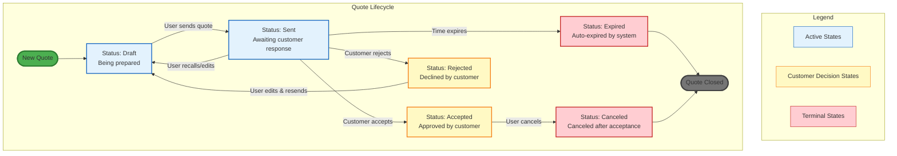
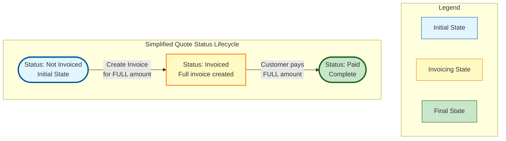
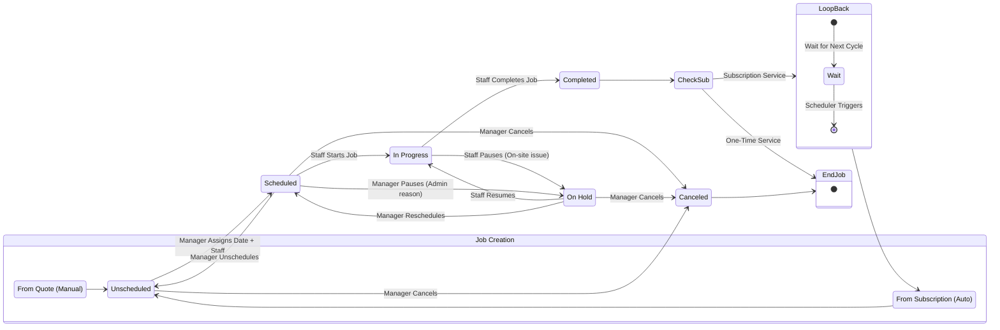
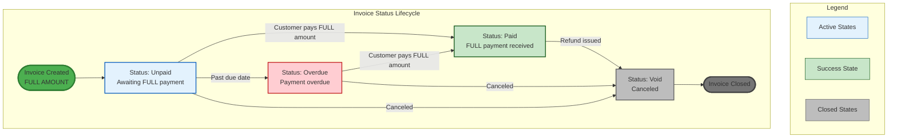

# Simplified Financial Flow (No Split Features)

## Overview
This simplified version removes:
- ❌ Split Invoice (partial invoicing of line items)
- ❌ Split Job (multiple jobs from one quote)
- ❌ Split Payment (partial payments on invoices)

**Key Principle:** One Quote → One Invoice → One Payment → One Job

---

## Flow 1: Simplified Financial Flow (One-Time vs Subscription)

```mermaid
graph TD
    subgraph Legend["Legend"]
        direction LR
        L2[System Process]
        L3((Start / End))
        L4[Auto System]
        L5[/User Action/]
        L6[Status]
    end
    
    style L2 fill:#ECECFF,stroke:#9370DB
    style L3 fill:#f9f,stroke:#333,stroke-width:2px
    style L4 fill:#FFD700,stroke:#B8860B
    style L5 fill:#DAE8FC,stroke:#6C8EBF
    style L6 fill:#D5E8D4,stroke:#82B366
    
    subgraph Flow["Simplified Financial Flow"]
        Start((Start Financial Event)) --> Trigger{Service Type?}
        
        Trigger -->|1. One-Time Service| CreateInv[/User Clicks Create Invoice/]
        CreateInv --> InvA[System Creates Invoice<br/>for FULL QUOTE AMOUNT<br/>Status: UNPAID]
        InvA --> GenLink[System Creates Payment Link]
        GenLink --> SendLink[/User Manually Sends Link<br/>Email/SMS/WhatsApp/]
        SendLink --> Pay1[Customer Pays FULL AMOUNT via Link]
        Pay1 --> S_Paid[Invoice Status: PAID<br/>Quote Status: PAID]
        S_Paid --> End1((Quote Complete))
        
        Trigger -->|2. Subscription Service| Scheduler[System Scheduler Triggers<br/>e.g., 1st day of month]
        Scheduler --> CardOnFile{Customer has saved<br/>Credit Card/Account?}
        
        CardOnFile -->|Yes 99% Case| AutoCharge[System AUTO-CHARGES<br/>FULL AMOUNT<br/>Stripe/PayPal Auto-Charge]
        AutoCharge --> ChargeOK{Charge Successful?}
        ChargeOK -->|Yes| AutoInvPaid[System Creates Invoice Status: PAID<br/>and Sends Receipt]
        AutoInvPaid --> Loop2((Wait for next cycle))
        Loop2 --> Scheduler
        
        ChargeOK -->|No Card Error| Dunning[Start Dunning Process<br/>Send emails, retry...]
        Dunning --> EndFail((Pause Subscription))
        
        CardOnFile -->|No Rare Case| AutoInvUnpaid[System Auto-Creates<br/>Invoice Status: UNPAID<br/>FULL AMOUNT]
        AutoInvUnpaid --> GenLink2[System Creates Payment Link]
        GenLink2 --> SendLink2[System Auto-Sends Link<br/>e.g., Email invoice]
        SendLink2 --> Pay1
    end
    
    style CreateInv fill:#DAE8FC,stroke:#6C8EBF
    style SendLink fill:#DAE8FC,stroke:#6C8EBF
    
    style InvA fill:#ECECFF,stroke:#9370DB
    style GenLink fill:#ECECFF,stroke:#9370DB
    style Pay1 fill:#ECECFF,stroke:#9370DB
    style GenLink2 fill:#ECECFF,stroke:#9370DB
    
    style Scheduler fill:#FFD700,stroke:#B8860B
    style AutoCharge fill:#FFD700,stroke:#B8860B
    style AutoInvPaid fill:#FFD700,stroke:#B8860B
    style Dunning fill:#FFD700,stroke:#B8860B
    style AutoInvUnpaid fill:#FFD700,stroke:#B8860B
    style SendLink2 fill:#FFD700,stroke:#B8860B
    
    style S_Paid fill:#D5E8D4,stroke:#82B366
```



---

## Flow 2: Quote Operation Status Lifecycle



---

## Flow 3: Simplified Quote Financial Status



**Simplified States:**
- **Not Invoiced** → Initial state after quote accepted
- **Invoiced** → Full invoice created for entire quote amount
- **Paid** → Full payment received

**Removed States:**
- ❌ Partially Invoiced
- ❌ Partially Paid

---

## Flow 4: Simplified Job Status Lifecycle



**Key Points:**
- One Quote → One Job (no split jobs)
- Job is created for the entire quote scope
- Subscription jobs repeat automatically

---

## Flow 5: Simplified Invoice Status Lifecycle



**Key Points:**
- Invoice is always for the FULL quote amount
- Payment must be FULL amount (no partial payments)
- Simpler states: Unpaid → Paid

---

## Key Differences from Enhanced Flow

### ❌ Removed Features

| Feature | Original | Simplified |
|---------|----------|------------|
| **Invoice Creation** | Can select specific line items | Always full quote amount |
| **Payment** | Can pay partially | Must pay full amount |
| **Quote Status** | Not Invoiced → Partially Invoiced → Fully Invoiced → Partially Paid → Paid | Not Invoiced → Invoiced → Paid |
| **Job Creation** | Can create multiple jobs from one quote | One quote = One job |
| **Flexibility** | High (split billing, progress payments) | Low (all-or-nothing) |

### ✅ Benefits of Simplified Flow

1. **Simpler UI/UX**
   - No need for line item selection in invoice creation
   - No partial payment tracking
   - Fewer status badges and states

2. **Easier Implementation**
   - Less complex database schema
   - Simpler business logic
   - Fewer edge cases to handle

3. **Faster Development**
   - Reduced testing scenarios
   - Simpler validation rules
   - Less code to maintain

4. **Clearer User Experience**
   - One invoice per quote
   - One payment per invoice
   - One job per quote
   - Easy to understand workflow

### ⚠️ Limitations

1. **No Progress Billing**
   - Cannot invoice for down payment, then final payment
   - Must invoice full amount upfront

2. **No Partial Payments**
   - Customer must pay full amount at once
   - Cannot accept installments

3. **No Flexible Job Splitting**
   - Cannot break one quote into multiple service visits
   - One job must cover entire quote scope

---

## Implementation Recommendations

### Database Schema Changes

**Quote Table:**
```sql
-- Simplified fields
quote_status: ENUM('draft', 'sent', 'accepted', 'rejected', 'expired', 'canceled')
financial_status: ENUM('not_invoiced', 'invoiced', 'paid')  -- Only 3 states
total_amount: DECIMAL
invoice_id: INT (nullable, single invoice reference)
job_id: INT (nullable, single job reference)
```

**Invoice Table:**
```sql
-- Simplified fields
invoice_status: ENUM('unpaid', 'overdue', 'paid', 'void')
quote_id: INT (one-to-one relationship)
total_amount: DECIMAL (always equals quote.total_amount)
paid_amount: DECIMAL (0 or total_amount, no partial)
```

**Job Table:**
```sql
-- Simplified fields
job_status: ENUM('unscheduled', 'scheduled', 'in_progress', 'on_hold', 'completed', 'canceled')
quote_id: INT (one-to-one relationship)
invoice_id: INT (reference to single invoice)
```

### UI Changes Required

1. **Quote List Page**
   - Remove "Partially Invoiced" badge
   - Remove "Partially Paid" badge
   - Only show: Not Invoiced, Invoiced, Paid

2. **Invoice Creation**
   - Remove line item selection interface
   - Auto-populate with full quote amount
   - Single "Create Invoice" button

3. **Payment Processing**
   - Remove partial payment option
   - Only accept full amount
   - Simpler payment form

4. **Job Creation**
   - Auto-create job from quote
   - No job splitting options
   - One-click job creation

---

## Migration Path

If migrating from enhanced to simplified:

1. **Existing Partial Invoices**
   - Consolidate into single invoice
   - Or mark as legacy and start fresh

2. **Existing Partial Payments**
   - Complete remaining payments
   - Or refund and re-invoice full amount

3. **Existing Split Jobs**
   - Complete current jobs
   - New quotes follow simplified flow

---

## Conclusion

The simplified flow is ideal for:
- ✅ Small businesses with simple billing
- ✅ Services with upfront payment
- ✅ Subscription-based services
- ✅ Teams wanting faster implementation
- ✅ MVPs and proof-of-concepts

Consider the enhanced flow if you need:
- ❌ Progress billing (down payment + final payment)
- ❌ Installment payments
- ❌ Complex project billing
- ❌ Multiple service visits per quote
