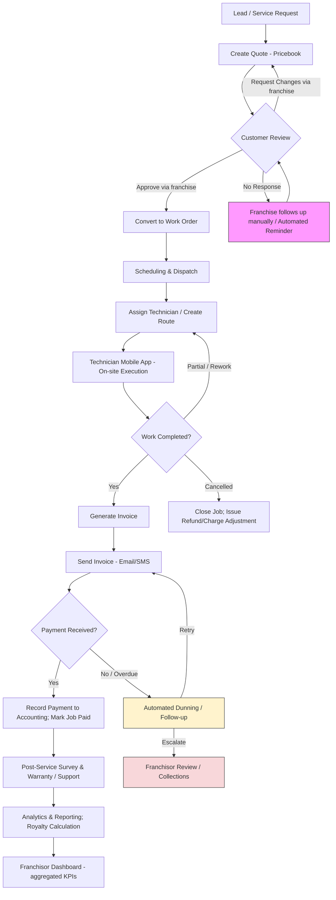
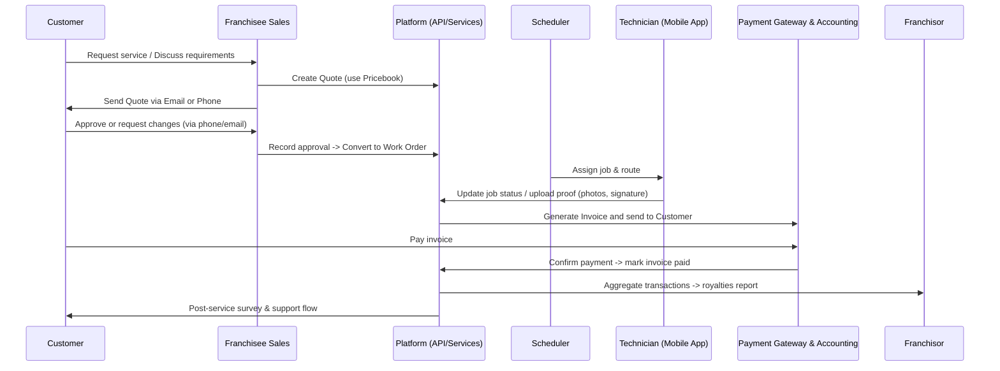

# To-Be: Quote-to-Cash + Field Service Flow

This document describes the proposed "To-Be" flow for the Franchise ERP system. It is based on the provided `As_is.md` and `quote_process.md` analysis and focuses on the end-to-end Quote-to-Cash process integrated with Field Service execution and Franchisor reporting.

## High-level Mermaid Flowchart

## Swimlane (Actors & Responsibilities)

## Key Data Objects
- Pricebook / Service Catalog
- Quote / Proposal (versions allowed)
- Work Order / Job
- Invoice & Payment Record
- Proof-of-Service (photos/signature/checklist)
 - Customer Account (contact record; no client portal)
- Franchisee Account & Royalty records

## Decision Points
- Customer Review: Approve / Request Changes / No Response
- Deposit required? (configured per pricebook item)
- Scheduling logic: immediate vs queued vs manual
- Work result: complete / partial / cancelled
- Invoice payment: success / failure / dispute

## Edge Cases
1. Partial completion -> create Change Order and re-quote on-site.
2. Offline technician -> local queue + idempotent sync.
3. Payment dispute -> attach proof-of-service, start dispute workflow, withhold royalty until resolved.
4. Duplicate quote edits -> optimistic locking and merge/refresh UI.
5. Long-running jobs -> support progress invoicing.

## Success Criteria
- Quote -> Approved -> Job Completed -> Invoice Paid (SLA: e.g., 7 days)
- Payment capture rate > 98%
- Average schedule time < 48 hours
- Royalty calculation accuracy = 100%

## Next Steps
- Export Mermaid to PNG/SVG for inclusion in docs.
- Produce an OpenAPI skeleton for key endpoints (quotes, work-orders, invoices, payments).
- Design email/SMS templates and standard operating procedures for franchise-mediated quote delivery and approval.

---

Document created from `As_is.md` and `quote_process.md` analysis on 2025-10-21.
