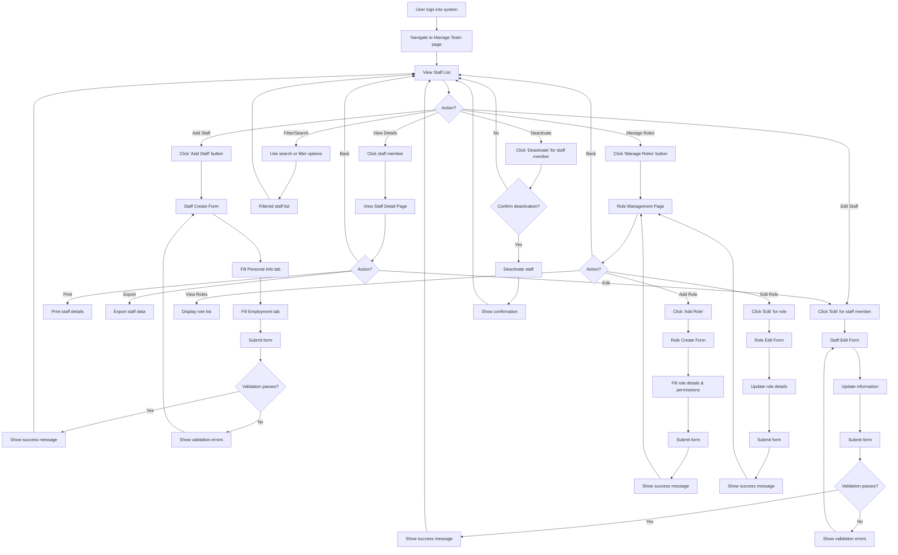

# Manage Team Process Flow

This document contains the process flow diagrams for the Manage Team feature in both flowchart and sequence diagram formats.

## Flowchart: Manage Team User Journey

## Sequence Diagram: Staff Management Operations

```mermaid
sequenceDiagram
    participant U as User (Admin/Manager)
    participant FE as Frontend (Web App)
    participant API as Backend API
    participant DB as Database
    participant ES as Email Service

    %% Create Staff Flow
    rect rgb(240, 248, 255)
        Note over U,ES: Create New Staff Member
        U->>FE: Click "Add Staff" button
        FE->>FE: Display create form
        U->>FE: Fill form data (personal, employment info)
        U->>FE: Submit form
        FE->>FE: Validate form data
        FE->>API: POST /api/staff (staff data)
        API->>API: Validate business rules
        API->>DB: INSERT staff record
        DB-->>API: Return staff ID
        API->>ES: Send invitation email (if requested)
        ES-->>API: Email sent confirmation
        API-->>FE: Return success response
        FE->>FE: Show success message
        FE->>FE: Redirect to staff list
    end

    %% View Staff Details Flow
    rect rgb(255, 248, 220)
        Note over U,DB: View Staff Details
        U->>FE: Click staff member name/link
        FE->>API: GET /api/staff/{id}
        API->>DB: SELECT staff record
        DB-->>API: Return staff data
        API-->>FE: Return staff details
        FE->>FE: Display staff detail page
    end

    %% Update Staff Flow
    rect rgb(240, 255, 240)
        Note over U,ES: Update Staff Information
        U->>FE: Click "Edit" for staff member
        FE->>API: GET /api/staff/{id}
        API->>DB: SELECT staff record
        DB-->>API: Return staff data
        API-->>FE: Return staff details
        FE->>FE: Pre-populate edit form
        U->>FE: Modify staff data
        U->>FE: Submit form
        FE->>FE: Validate form data
        FE->>API: PUT /api/staff/{id} (updated data)
        API->>API: Validate business rules
        API->>DB: UPDATE staff record
        DB-->>API: Confirm update
        API->>ES: Send update notification (if requested)
        ES-->>API: Email sent confirmation
        API-->>FE: Return success response
        FE->>FE: Show success message
        FE->>FE: Redirect to staff list
    end

    %% Deactivate Staff Flow
    rect rgb(255, 240, 240)
        Note over U,DB: Deactivate Staff Member
        U->>FE: Click "Deactivate" for staff member
        FE->>FE: Show confirmation dialog
        U->>FE: Confirm deactivation
        FE->>API: PUT /api/staff/{id}/status (inactive)
        API->>DB: UPDATE staff status
        DB-->>API: Confirm update
        API-->>FE: Return success response
        FE->>FE: Show confirmation message
        FE->>FE: Update staff list display
    end

    %% Search/Filter Staff Flow
    rect rgb(248, 248, 255)
        Note over U,DB: Search/Filter Staff
        U->>FE: Enter search term or select filter
        FE->>FE: Apply client-side filtering
        alt If advanced filtering needed
            FE->>API: GET /api/staff?search={term}&role={role}&status={status}
            API->>DB: SELECT staff with filters
            DB-->>API: Return filtered results
            API-->>FE: Return staff list
        end
        FE->>FE: Update displayed staff list
    end

    %% Role Management Flow
    rect rgb(255, 248, 248)
        Note over U,DB: Manage Roles
        U->>FE: Click "Manage Roles" button
        FE->>API: GET /api/roles
        API->>DB: SELECT all roles
        DB-->>API: Return roles data
        API-->>FE: Return roles list
        FE->>FE: Display roles management page

        U->>FE: Click "Add Role" or "Edit Role"
        FE->>FE: Display role form
        U->>FE: Fill/update role details & permissions
        U->>FE: Submit form
        FE->>API: POST/PUT /api/roles (role data)
        API->>DB: INSERT/UPDATE role record
        DB-->>API: Confirm operation
        API-->>FE: Return success response
        FE->>FE: Show success message
        FE->>FE: Refresh roles list
    end
```

## Process Overview

### Key User Journeys:
1. **Staff Creation**: Admin fills out multi-tab form → System validates → Creates record → Sends invitation email
2. **Staff Management**: View list → Filter/search → View details → Edit or deactivate as needed
3. **Role Management**: Define roles with permissions → Assign to staff members
4. **Reporting**: Export staff data → Print individual profiles

### System Interactions:
- **Frontend**: Form validation, UI state management, user interactions
- **Backend API**: Business logic validation, data processing, email notifications
- **Database**: CRUD operations on staff and role entities
- **Email Service**: Automated notifications for invitations and updates

### Business Rules:
- Email uniqueness validation
- Required field validation
- Start date cannot be in future
- Role-based access control
- Audit trail for all changes

### Error Handling:
- Form validation errors displayed inline
- Server errors shown as user-friendly messages
- Confirmation dialogs for destructive actions
- Rollback capabilities for failed operations</content>
<parameter name="filePath">c:\Users\Giang Esley\Downloads\fms-product-management\manage-team\manage-team-process-flow.md