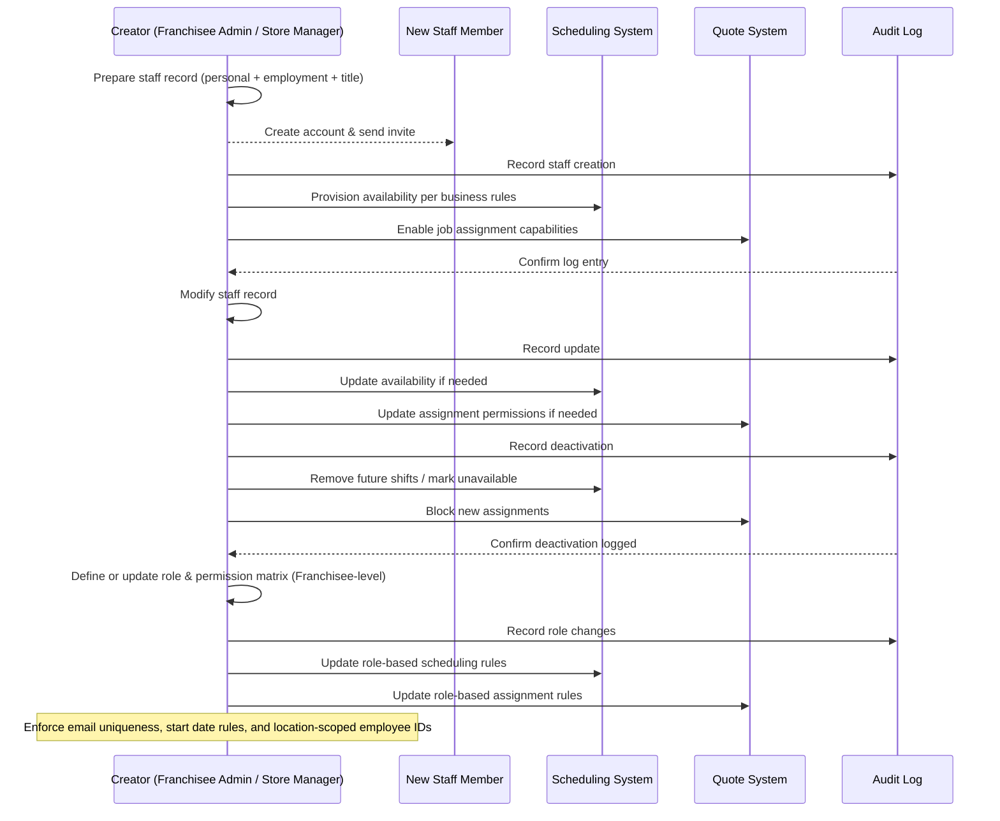

# Manage Team — Mermaid Charts

This file contains Mermaid diagrams (flowchart and sequence) for the Manage Team feature.

## Flowchart (User Journey)

```mermaid
flowchart TD
  A[Authorized user (Admin/Manager) arrives] --> B[Open Manage Team]
  B --> C[View staff directory]

  C --> D{Select action}
  D -->|View profile| E[Open staff profile]
  D -->|Add staff| F[Start Add Staff process]
  D -->|Edit staff| G[Start Edit Staff process]
  D -->|Search / Filter| H[Apply business filters]
  D -->|Manage roles| I[Open Role & Permission matrix]
  D -->|Deactivate| J[Initiate deactivation flow]

  %% View profile actions
  E --> K{Profile actions}
  K -->|Request edit| G
  K -->|Export| L[Export staff summary]
  K -->|Assign to customer| M[Assign staff as contact]
  K -->|Back| C

  %% Add staff business process (direct creation)
  F --> N[Collect Personal Information]
  N --> O[Collect Employment Information]
  O --> P[Assign Title / Role]
  P --> R[Create staff record, set Active]
  R --> T[Trigger onboarding actions]
  T --> U[Notify staff (invite email)]
  T --> V[Create audit log entry]
  T --> W[Link staff to Scheduling & Quotes per business rules]
  R --> C

  %% Edit staff business process (direct)
  G --> X[Modify personal or employment data]
  X --> Y{Role change?}
  Y -->|Yes| Z[Apply changes, record audit]
  Y -->|No| Z
  Z --> AA[Notify affected systems: scheduling, quotes]
  AA --> V
  Z --> C

  %% Role management
  I --> AB1[Create / edit system roles]
  AB1 --> AB2[Define permission matrix and location scope]
  AB2 --> AB3[Save role]
  AB3 --> V

  %% Deactivation business rules
  J --> AC{Confirm deactivation}
  AC -->|Yes| AD[Set staff to Inactive]
  AD --> AE[Prevent new assignments (quotes/schedules)]
  AD --> V
  AC -->|No| C

  %% Supporting flows
  V --> C
```

## Sequence Diagram (Technical Flow)



---

Tips:
- To render these diagrams in Markdown viewers, use a Mermaid-enabled renderer (e.g., VS Code Mermaid preview extension, GitHub supports mermaid in some contexts, or use Mermaid Live Editor).
- You can copy these blocks directly into any mermaid-capable renderer to visualize.
