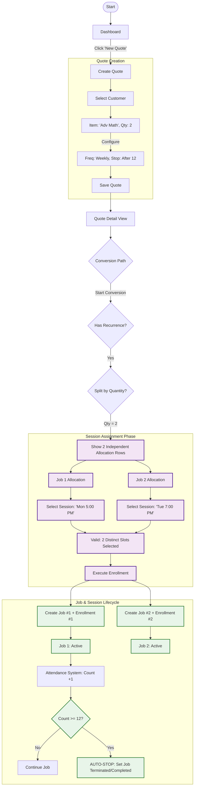

# User Journey Analysis: Quote to Session Flow

## Overview
This document outlines the user journey from creating a Quote to enrolling a customer in a Session. It analyzes the existing code implementation, specifically focusing on the "Convert to Jobs" and "Convert to Sessions" workflows, and identifies potential gaps.

## Flowchart with Scenario: Multi-Quantity & Fixed Term
**Scenario**: Manager sells *Advanced Math* x2 (Qty), 12-Week Course (Fixed).
**Goal**: Create 2 Jobs, assign Job 1 to Mon 5PM, Job 2 to Tue 7PM. Both stop after 12 classes.



## Detailed Analysis: Multi-Job Fixed-Term Flow

### 1. The "Split by Quantity" Requirement
When `Quantity > 1` for a Session-based item, the system cannot treat it as a bulk action. It implies multiple students or multiple distinct schedules for the same payer.

*   **UI Requirement**: The Conversion Modal must detect `Qty > 1` and render **X distinct rows** (where X = Qty).
    *   *Row 1 (Job 1)*: Dropdown to select Session (e.g., Mon 5PM).
    *   *Row 2 (Job 2)*: Dropdown to select Session (e.g., Tue 7PM).
*   **Result**: 
    *   Creates **Job A** linked to **Enrollment A** (Mon 5PM).
    *   Creates **Job B** linked to **Enrollment B** (Tue 7PM).

### 2. Auto-Termination Logic (The "Counter")
For items with `End Condition: After N Occurrences`:

*   **State Tracking**: Each **Job** record needs a counter field, e.g., `sessionsAttendedCount` or `sessionsScheduledCount`.
*   **The Check**: Every time attendance is marked (or a session passes), the system increments this counter.
*   **The Rule**:
    ```javascript
    if (job.sessionsAttendedCount >= job.maxOccurrences) {
        job.status = 'completed';
        enrollment.status = 'finished';
        // Stop generating future calendar slots for this enrollment
    }
    ```
*   **Scheduler Impact**: The calendar generator must look at the `Enrollment Start Date` and calculate exactly 12 occurrences forward for that specific slot sequence (e.g., 12 Mondays starting Sep 1st). The 13th Monday should NOT show this student.

### 3. Comparison of Logic

| Feature | Subscription (Open) | Fixed-Term (12 Weeks) |
| :--- | :--- | :--- |
| **Quantity Handling** | Split into X Jobs | **Split into X Jobs** |
| **Session Selection** | Pick 1 Slot per Job | **Pick 1 Slot per Job** |
| **End Date** | None (User cancels manually) | **Calculated** (Start + 12 * Interval) |
| **Termination** | Manual Cancellation | **Auto-Stop** (Count-based) |
| **Billing** | Recurring Invoice | **Upfront** (One-time pay) |

### 4. Technical Implementation Notes (Updated)

**Conversion Modal (`convert_to_sessions_modal_enhanced.html`)**:
*   **Current State**: Likely assumes 1 item = 1 selection.
*   **Required Change**: Iterate through `quoteItem.quantity`. If Qty=2, render the selection UI twice. Allow independent selection for each iteration.

**Job/Enrollment Structure**:
*   **Job**: Holds the "Contract" (`maxOccurrences: 12`, `currentCount: 0`).
*   **Enrollment**: Holds the "Schedule" (`session_id: Mon5PM`, `student_id: Alice`).

## Impact Analysis: Non-Subscription with Recurrence

### 1. Unified Enrollment Logic
*   **New Logic**: "Has Scheduling Requirements?" (Subscription OR Fixed Recurrence) -> If Yes -> Trigger Enrollment Flow.

### 2. Effects on Sessions & Enrollment

| Feature | Subscription Item | Non-Subscription (Fixed) Item | One-off / Product |
| :--- | :--- | :--- | :--- |
| **Recurrence** | Open-ended (Indefinite) | Finite (e.g., 12 weeks) | None |
| **Enrollment End Date** | `null` (Active indefinitely) | **Calculated** (`StartDate` + `Occurrences` * `Interval`) | N/A |
| **Session Slots** | Dynamic/Generating forward | **Fixed Set** (Specific 12 slots generate immediately) | N/A |
| **Job Status Logic** | Active until manually cancelled | **Auto-Completes** after last session? (Business Decision) | Completed immediately |
| **Conversion Modal** | Must pick "Session Group" | **Must pick "Session Group"** (Cohort) | Skipped |

## Deep Dive: Session Creation & Enrollment Logic (Updated)

**Scenario**: User sells a "12-Week Science Camp" (Non-Sub, Fixed).

*   **Step 1: Conversion**: The modal **MUST** appear. You cannot just "sell" the camp; you must decide *which* camp instance (e.g., "June Cohort" vs "July Cohort") the student is attending.
*   **Step 2: Creation (If needed)**: If creating a new Session for this item, the `Session_Creation` flow auto-fills the `End Date` or `Total Occurrences` based on the Pricebook Item settings (12 occurrences).
*   **Step 3: Enrollment Record**:
    *   **Student**: Alice
    *   **Session**: June Science Camp
    *   **Enrollment Type**: `Fixed-Term` (vs `Open-Ended`)
    *   **End Date**: **HARD SET** to the end of the 12th week.

## Mermaid Flowchart Source
You can copy the code below to render this diagram in other tools.

```text
flowchart TD
    %% Nodes
    Start([Start]) --> Dashboard
    Dashboard -->|Click 'New Quote'| CreateQuote[Create Quote]
    
    subgraph Quote_Creation [Quote Creation]
        CreateQuote --> AddCustomer[Select Customer]
        AddCustomer --> AddItems[Item: 'Adv Math', Qty: 2]
        AddItems -->|Configure| ItemDetails[Freq: Weekly, Stop: After 12]
        ItemDetails --> SaveQuote[Save Quote]
    end

    SaveQuote --> QuoteDetail[Quote Detail View]
    
    QuoteDetail --> ConversionDec{Conversion Path}
    
    %% Handling Items based on RECURRENCE
    ConversionDec -->|Start Conversion| CheckRecurrence{Has Recurrence?}
    
    %% Session-Based Items
    CheckRecurrence -->|Yes| SplitQty{Split by Quantity?}
    
    %% SPLIT LOGIC
    SplitQty -->|Qty = 2| ShowSplitUI[Show 2 Independent Allocation Rows]
    
    subgraph Enrollment_Selection [Session Assignment Phase]
        ShowSplitUI --> Row1[Job 1 Allocation]
        ShowSplitUI --> Row2[Job 2 Allocation]
        
        Row1 --> SelectSess1[Select Session: 'Mon 5:00 PM']
        Row2 --> SelectSess2[Select Session: 'Tue 7:00 PM']
        
        SelectSess1 --> Validate[Valid: 2 Distinct Slots Selected]
        SelectSess2 --> Validate
        
        Validate --> Execute[Execute Enrollment]
    end

    %% EXECUTION & LIFECYCLE
    subgraph Lifecycle [Job & Session Lifecycle]
        Execute --> CreateJob1[Create Job #1 + Enrollment #1]
        Execute --> CreateJob2[Create Job #2 + Enrollment #2]
        
        CreateJob1 --> Track1[Job 1: Active]
        CreateJob2 --> Track2[Job 2: Active]
        
        Track1 --> Attend1[Attendance System: Count +1]
        Attend1 --> CheckLimit1{Count >= 12?}
        CheckLimit1 -->|No| Continue1[Continue Job]
        CheckLimit1 -->|Yes| StopJob1[AUTO-STOP: Set Job Terminated/Completed]
    end

    %% Styling
    classDef pathA fill:#e1f5fe,stroke:#01579b,stroke-width:2px;
    classDef pathB fill:#f3e5f5,stroke:#4a148c,stroke-width:2px;
    classDef lifecycle fill:#e8f5e9,stroke:#2e7d32,stroke-width:2px;

    class CreateJob1,CreateJob2,Track1,Track2,CheckLimit1,StopJob1 lifecycle;
    class ShowSplitUI,Row1,Row2,SelectSess1,SelectSess2,Validate,Execute pathB;
```
